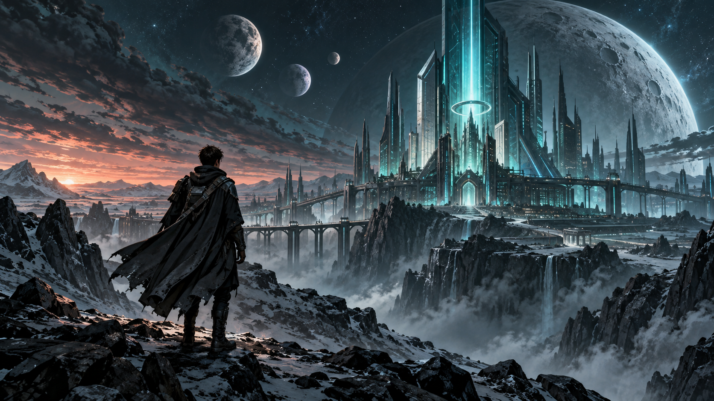

# 10. API-логика ассистента и базовый деплой

## Дикие идеи — пилот студии историй

[Открыть опубликованный сайт](https://wild-ideas-pilot.cocmosxx2.chatgpt.site/)

Сайт опубликован в Sites с доступом только владельцу. Проверяющему нужен отдельно предоставленный доступ; наличие исходников в GitHub не открывает приватный сайт.



## Что собрано

Первая страница знакомит со студией и пилотом «Пересечение трёх лун» по мотивам «Трёх мушкетёров». Цифровая ведущая Алина проводит подготовленный диалог. Затем посетитель выбирает один из трёх миров, по одному из трёх образов для каждого из трёх персонажей и согласует концепцию. После согласования открывается план первых 20 страниц с возможностью скачать его вместе с наброском заказа.

Озвучка использует SpeechSynthesis, голосовой ввод — SpeechRecognition при поддержке браузера. Микрофон включается только по кнопке. Распознанный текст подтверждается пользователем. Доступность голосовых функций зависит от браузера, установленного голоса и разрешений устройства.

## Состав задания

| Каталог | Содержимое |
|---|---|
| [WILD_IDEAS](WILD_IDEAS/) | Актуальный код сайта, изображения, диалог, выбор мира и героев, сценарный план |
| [BOOKCRAFT_CRM](BOOKCRAFT_CRM/) | Ранее подготовленная CRM и Node.js backend; самостоятельный модуль, пока не соединённый с «Дикими идеями» |
| [DZ_10](DZ_10/) | Исходный гайд занятия и пример диалога о деплое |
| [STATUS.md](STATUS.md) | Реализованное, ограничения и следующие этапы |

## Запуск сайта локально

Нужен Node.js 22.13 или новее.

```powershell
cd WILD_IDEAS
npm ci
npm run dev
```

Открыть адрес, выведенный сервером. Обычно это http://localhost:3000/.

```powershell
npm run build
npx tsc --noEmit
```

Стек: React 19, TypeScript, Vinext/Vite, компоненты Base UI/Shadcn. Опубликованная версия работает в Cloudflare Workers через Sites. Это текущий способ размещения; отдельный деплой на Render в этой итерации не выполнялся.

## Где находится логика

- `WILD_IDEAS/app/studio.tsx` — этапы диалога, выбор мира, персонажей и согласование.
- `WILD_IDEAS/app/story-data.ts` — вопросы, три мира, персонажи и план 20 страниц.
- `WILD_IDEAS/app/use-voice.ts` — озвучка, распознавание речи, остановка и сообщения об ошибках.
- `WILD_IDEAS/app/page.tsx` — первая страница.
- `WILD_IDEAS/public/` — подготовленные визуальные материалы.
- `BOOKCRAFT_CRM/server.cjs` — отдельный HTTP-сервер CRM: в том числе `/api/health` и `/api/catalog`.

## Соответствие теме занятия

Проект оформлен отдельными файлами, зависимости зафиксированы, выполнена сборка и получен стабильный HTTPS-адрес. В комплекте сохранён отдельный backend CRM для последующей интеграции.

Бизнес-логика ведущей сейчас выполняется на клиенте по подготовленному сценарию. Единого backend, связывающего LLM, генерацию комикса и приём заказа, пока нет. Поэтому комплект фиксирует текущий этап MVP, а не завершение всех требований к комплексной backend-системе.

## Важные границы версии

- Алина — вымышленный цифровой портрет с озвучкой, не видеоперсонаж с синхронизацией губ.
- Карточки миров и героев подготовлены заранее. Это не генерация по запросу посетителя.
- 20 страниц представлены планом, а не готовыми рисунками комикса.
- Выбор хранится в памяти страницы до перезагрузки; итог можно скачать.
- Заказы пока не отправляются Алине и не сохраняются в CRM.
- Исходные инструкции `BOOKCRAFT_CRM/DEPLOY_DZ10.md` относятся к предыдущему варианту проекта и содержат прежние ветку и путь. Для нового деплоя их нужно адаптировать.

Проверки актуального WILD_IDEAS: успешная сборка, проверка TypeScript, HTTP-ответ локальной страницы 200 и успешный статус публикации Sites. Работа реального микрофона на устройстве пользователя не проверялась. CRM в рамках упаковки не изменялась и повторно не тестировалась.
