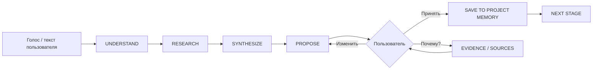

# Дикие идеи → в деньги: production dialogue architecture

## Принцип

Алина — не обычный чат. Она является человеко-ориентированным интерфейсом к управляемому production-workflow. Ключевые решения подтверждает пользователь; исследования, гипотезы и сопоставимые проекты хранятся отдельно.

## Диалоговый цикл



## Слои проекта

```text
PROJECT MEMORY
├── IDEA
├── RESEARCH PACK
├── STORY DNA
├── WORLD
├── CHARACTERS
├── RELATIONSHIPS
├── VISUALS
├── STORY GRAPH
└── PRODUCTION PACK
```

## Статусы утверждений

- **FACT** — утверждение прямо поддерживается источником.
- **MARKET SIGNAL** — наблюдаемая тенденция или сопоставимый паттерн; не гарантия результата.
- **HYPOTHESIS** — предложение Алины, которое требует проверки или решения пользователя.
- **USER CONFIRMED** — решение принято пользователем и может влиять на следующие стадии.

## Evidence contract

Каждый исследовательский элемент должен со временем иметь:

```json
{
  "id": "source-id",
  "title": "Название",
  "publisher": "Организация / автор",
  "year": "2026",
  "url": "https://...",
  "kind": "audience | market | legal | craft | comparable",
  "signal": "Что источник поддерживает",
  "limitations": "Что из источника выводить нельзя",
  "confidence": "low | medium | high"
}
```

## Narrative module contract

```json
{
  "id": "PAT-0042",
  "name": "Rivals become allies",
  "purpose": "Зачем модуль нужен",
  "mechanic": "конфликт → общая угроза → совместное действие → доверие",
  "genres": ["adventure", "academy", "spy"],
  "sources": [],
  "comparables": [],
  "common_failures": [],
  "fit_score": 0,
  "fit_score_kind": "demo_heuristic"
}
```

## Правило оценки

`FIT SCORE` в MVP — прозрачная эвристика совместимости модулей с замыслом, а не вероятность продаж, рейтинга или кассового успеха. Production-версия должна выводить отдельно историческую устойчивость, соответствие аудитории, рыночный сигнал, совместимость мотивов, сериализуемость, производственный риск и неопределённость данных.

## Что уже реализовано в MVP

1. Центральная Алина и HUD-состояния.
2. Research Workspace с источниками, ограничениями и сопоставимыми проектами.
3. Research Pack, который визуально сворачивается в память проекта.
4. Narrative Constructor с жанрами и выбираемыми STORY DNA модулями.
5. Миры и персонажи с заранее подготовленными визуальными концептами.
6. Пользовательское подтверждение перед финальным планом.
7. Экспорт проектного пакета.

## Следующие production-слои

- MediaRecorder → серверный STT → структурированный transcript event.
- API orchestration вместо клиентского сценария.
- долговременная Project Memory в БД;
- версии STORY DNA;
- настоящий Story Graph и causal validator;
- библиотека тысяч пользовательских схем с происхождением источника;
- RAG по Narrative Library;
- генератор visual brief / storyboard;
- права и provenance на уровне каждого ассета;
- роли reviewer / editor / producer;
- telemetry и audit trail.
