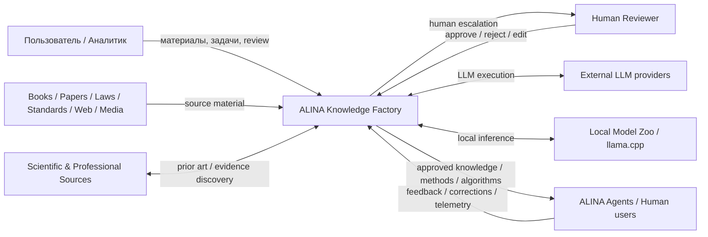
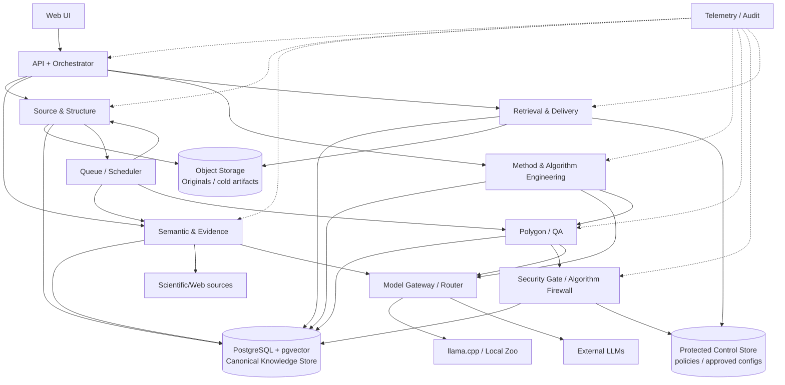
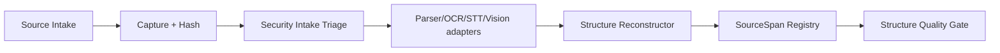
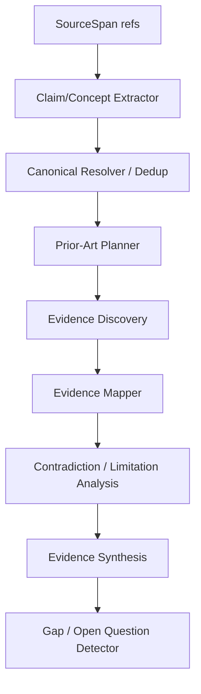
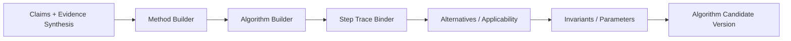
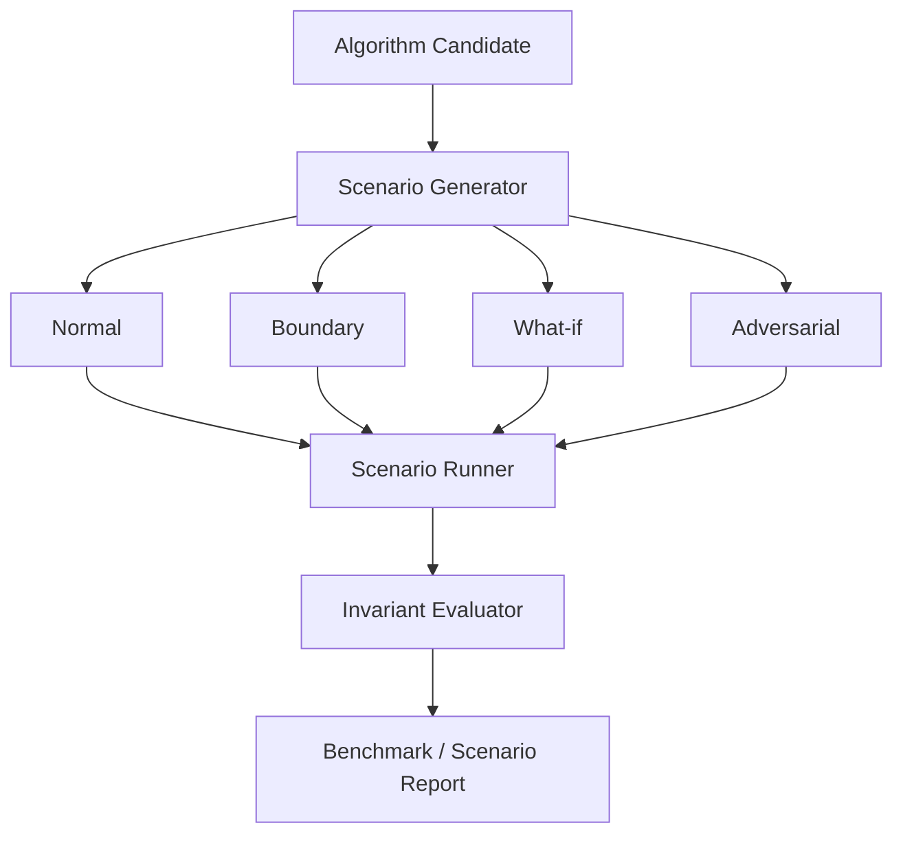
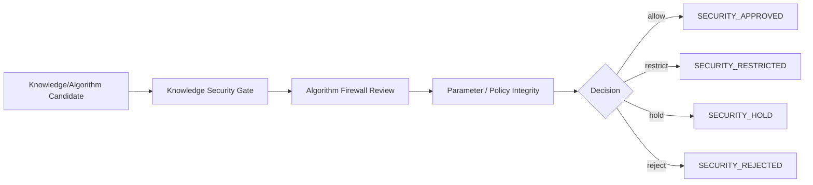
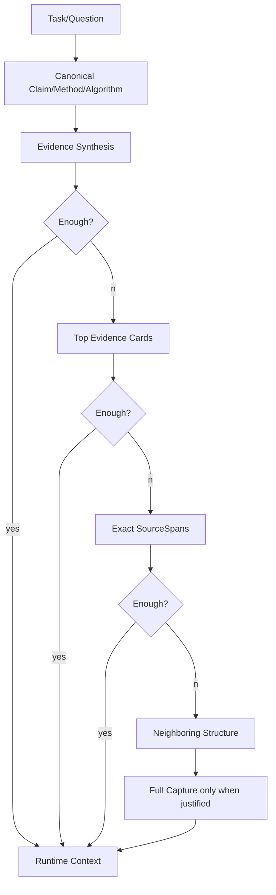
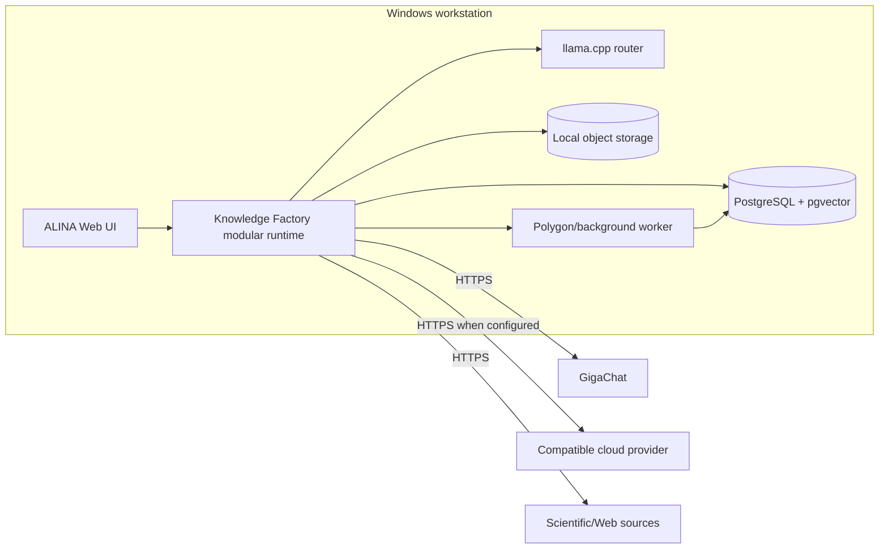
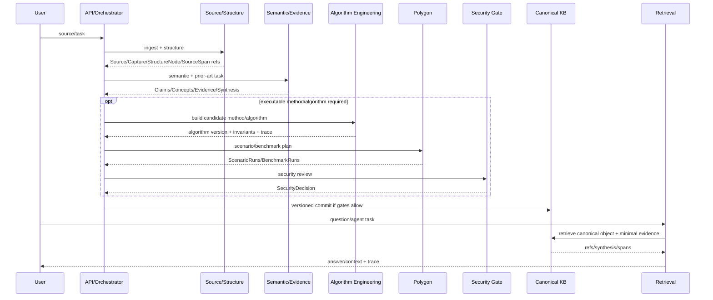

# ALINA Knowledge Factory / Universal Analyst Core — C4 Architecture

Version: `0.2`  
Status: `SELECTED / EVOLVING`

## 0. Назначение

C4 отвечает на вопрос **где и какими программными границами реализуются функции IDEF0 A1–A9**.

Функциональная master-модель: `processes/IDEF0_MODEL.md`.  
Последовательность/роли: `processes/BPMN_MAIN_PROCESS.md`.  
Data model: `design/CANONICAL_KNOWLEDGE_DATA_MODEL.md`.

Ключевой поток:

```text
SOURCE
→ STRUCTURE
→ SEMANTIC OBJECTS
→ PRIOR ART / EVIDENCE
→ METHOD / ALGORITHM
→ POLYGON
→ SECURITY GATE
→ CANONICAL KB
→ MINIMAL SUFFICIENT RAG
→ FEEDBACK / NEW VERSION
```

P0 архитектурный принцип:

```text
LOGICAL BOUNDARIES NOW
PHYSICAL MICROSERVICES ONLY WHEN MEASUREMENTS REQUIRE THEM
```

То есть на первом этапе строим модульный монолит/несколько локальных процессов, а не заранее размножаем сервисы.

---

# 1. C4 Level 1 — System Context



ALINA отвечает за provenance, canonical identity, evidence graph, algorithm lifecycle, polygon, security admission и controlled delivery.

ALINA не принимает model output за независимое доказательство и не позволяет retrieved content менять control-plane конфигурацию.

---

# 2. C4 Level 2 — Logical Containers



## 2.1 Container responsibilities

| Container | IDEF0 | Responsibility |
|---|---|---|
| Web UI | all | управление задачами, review, trace, карты знаний |
| API + Orchestrator | A1–A9 | jobs, state transitions, routing, contracts |
| Source & Structure | A1–A2 | Source/Capture/hash/security intake, parsing, StructureNode/SourceSpan |
| Semantic & Evidence | A3–A4 | Claim/Concept, prior art, Evidence graph, contradiction, synthesis |
| Method & Algorithm Engineering | A5 | Method/Algorithm/ImplementationOption и trace каждого шага |
| Polygon / QA | A6 | benchmark, normal/boundary/what-if/adversarial scenarios |
| Security Gate | A1/A7 | knowledge security status, algorithm firewall, allow/restrict/hold/reject |
| Retrieval & Delivery | A8 | minimal sufficient evidence, RAG escalation, localized projection |
| Model Gateway | support | local/cloud routing, provider isolation, model trace |
| Queue/Scheduler | support | long-running work, retries, resource limits |
| Telemetry/Audit | A9/support | immutable-ish events, metrics, regression/feedback |
| PostgreSQL + pgvector | A1–A9 | canonical data model + graph projection + vector indexes |
| Object Storage | A1–A2/A8 | original captures/cold artifacts; content-addressed dedup |
| Protected Control Store | A5–A8 | approved runtime config/policies/tool permissions; no RAG write path |

---

# 3. P0 physical choice: modular monolith

Logical container does not automatically mean separate deployable service.

P0:

```text
ALINA WEB/RUNTIME PROCESS
├── api-orchestrator module
├── source-structure module
├── semantic-evidence module
├── algorithm-engineering module
├── retrieval module
├── security-policy adapter
└── telemetry adapter

SEPARATE LOCAL PROCESSES
├── llama.cpp router
├── PostgreSQL + pgvector
└── optional polygon workers

STORAGE
├── PostgreSQL
└── local/object filesystem
```

Выносить модуль в отдельный process/service будем при измеренном основании: изоляция безопасности, отдельный scaling profile, ресурсный конфликт, latency/SLO или независимый lifecycle.

---

# 4. C4 Level 3 — Components

## 4.1 Source & Structure



Не создаёт canonical semantic knowledge.

## 4.2 Semantic & Evidence



Принцип: новый canonical object создаётся только после resolve/search existing.

## 4.3 Method & Algorithm Engineering



Каждый значимый step должен иметь evidence/requirement/project-decision origin.

## 4.4 Polygon / QA



## 4.5 Security Gate / Algorithm Firewall



Security plane может блокировать использование, но не переписывает предметное знание.

## 4.6 Retrieval & Delivery



Mandatory policy/security controls are hard-pinned outside ordinary relevance ranking.

---

# 5. Data ownership

Canonical SoT is not split by agent.

```text
PostgreSQL
├── SOURCE PLANE
├── KNOWLEDGE PLANE
├── VALIDATION PLANE
└── DELIVERY METADATA

Object Storage
└── originals / large captures / cold artifacts

Protected Control Store
└── policies / approved algorithm runtime configs / permissions
```

P0 Protected Control Store may physically be a separately permissioned PostgreSQL schema, but application DB roles must prevent retrieval/LLM code from mutating it.

Design DDL: `design/postgres/knowledge_factory_v0.sql`.

---

# 6. Code boundaries — target module map

Current implementation may remain in `DZ_17/app`; this map defines responsibilities rather than forcing a language/framework migration.

```text
knowledge-factory/
├── source/
│   ├── registry
│   ├── capture
│   ├── structure
│   └── spans
├── semantic/
│   ├── claim-extractor
│   ├── canonical-resolver
│   ├── contradiction
│   └── concept-mapper
├── evidence/
│   ├── discovery
│   ├── mapper
│   ├── synthesis
│   └── source-quality
├── algorithm/
│   ├── method-builder
│   ├── algorithm-builder
│   ├── trace-binder
│   └── config-change
├── polygon/
│   ├── scenario-generator
│   ├── runner
│   └── invariant-evaluator
├── security/
│   ├── knowledge-gate
│   ├── algorithm-firewall
│   └── control-plane-policy
├── retrieval/
│   ├── planner
│   ├── evidence-ladder
│   ├── context-budget
│   └── localization
├── storage/
│   ├── postgres
│   ├── object-store
│   └── vector-index
└── telemetry/
    ├── trace
    └── metrics
```

Provider adapters remain outside domain logic:

```text
models/providers/llamacpp
models/providers/gigachat
models/providers/compatible
```

---

# 7. Deployment — current workstation P0



Начальный resource policy измеряется, а не считается постоянной архитектурой.

---

# 8. Main sequence



---

# 9. Architecture invariants

1. Original source stored/addressed independently from semantic knowledge.
2. Runtime chunk/window is not canonical identity.
3. LLM/provider SDK cannot be imported into domain contracts as authority.
4. Canonical objects are shared across agents/languages.
5. Evidence and contradictions remain addressable after synthesis.
6. Approved control-plane configuration has no write path from retrieved/user/model text.
7. Security decision and subject-matter review are separate artifacts.
8. Full source retrieval is escalation, not default behavior.
9. P0 remains modular and simple until telemetry justifies physical decomposition.

---

# 10. Next architecture step

C4 v0.2 establishes the software boundaries. Next synchronization target:

```text
API_CONTRACTS
→ JSON Schemas
→ repository/service interfaces
→ first Source→Structure→Claim/Evidence vertical slice
```
