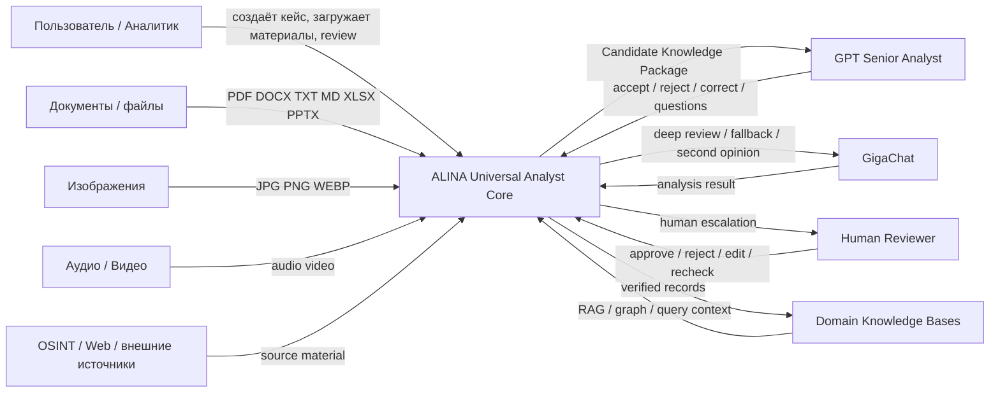
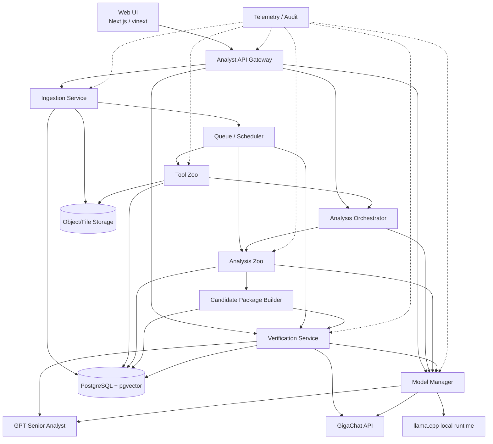
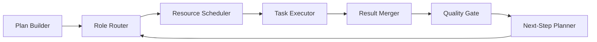
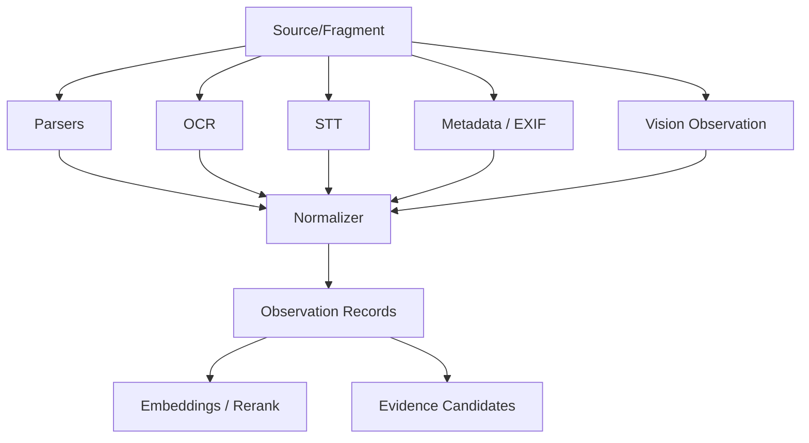
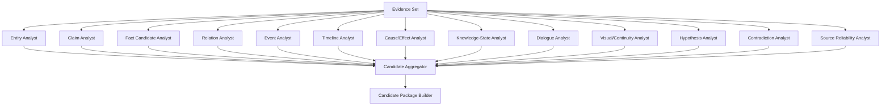
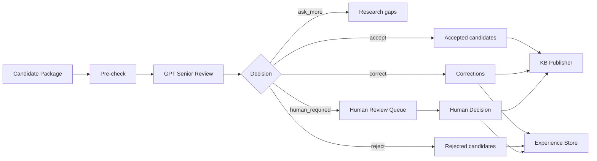
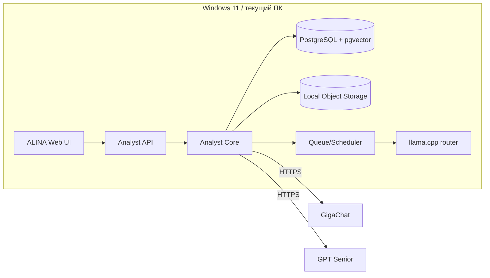
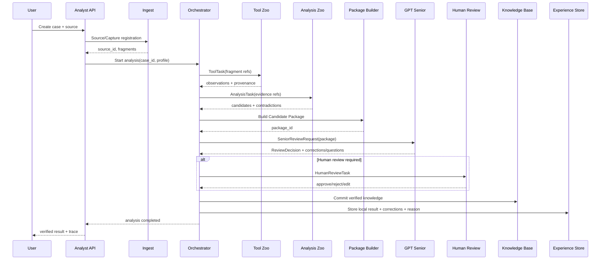

# ALINA / Universal Analyst Core — C4 Architecture

## 0. Назначение

Этот документ фиксирует архитектуру Universal Analyst Core в модели C4 и является переходом от генерального ТЗ к API-контрактам.

Ключевой принцип:

```text
RAW DATA
→ TOOL ZOO
→ OBSERVATIONS / EVIDENCE
→ ANALYSIS ZOO
→ CANDIDATE KNOWLEDGE PACKAGE
→ GPT SENIOR ANALYST
→ HUMAN REVIEW when required
→ VERIFIED KNOWLEDGE
→ DOMAIN KB
→ EXPERIENCE STORE
```

В C4 используем:

- Level 1 — System Context;
- Level 2 — Containers;
- Level 3 — Components;
- Level 4 — code-level boundaries/модули ключевых контейнеров;
- Deployment — отдельная схема развёртывания на текущем ПК.

---

# 1. C4 Level 1 — System Context



## Ответственность системы

ALINA отвечает за:

- регистрацию источников;
- сохранение оригинала и provenance;
- декомпозицию и нормализацию;
- Tool Zoo;
- Evidence Layer;
- Analysis Zoo;
- Candidate Knowledge Package;
- взаимодействие с GPT Senior Analyst;
- human review workflow;
- запись verified knowledge;
- Experience/Correction Store;
- Model Manager;
- scheduler и telemetry.

ALINA **не** должна скрыто повышать статус `observation/claim/hypothesis` до `verified fact`.

---

# 2. C4 Level 2 — Containers



## Контейнеры

| Container | Назначение | Принимает | Отдаёт |
|---|---|---|---|
| Web UI | пользовательская работа | actions/forms/files | REST calls, review decisions |
| Analyst API Gateway | единая входная точка | HTTP/JSON/multipart | normalized API responses |
| Ingestion Service | регистрация и разбор источника | SourceCreate, file refs | Source, Capture, Fragment jobs |
| Analysis Orchestrator | строит план анализа | case/profile/source refs | ToolTask/AnalysisTask/PackageTask |
| Tool Zoo | извлекает observations | source/fragment refs | Observation/Evidence candidates |
| Analysis Zoo | строит кандидаты знаний | evidence refs/profile | entity/claim/fact/relation/event/... candidates |
| Candidate Package Builder | компактный пакет для Senior | candidates + provenance | CandidateKnowledgePackage |
| Verification Service | Senior/Human review | package/review task | ReviewDecision/Corrections/Questions |
| Model Manager | модель/провайдер/маршрут | role/task/capability | model execution/result/trace |
| Queue/Scheduler | приоритеты и ресурсы | jobs | assigned jobs/status |
| Storage Layer | source of truth | domain records | DB/object records |
| Telemetry/Audit | трассировка | events/metrics | dashboards/logs/ETA |

---

# 3. C4 Level 3 — Components

## 3.1 Analysis Orchestrator



### Компоненты

- `PlanBuilder` — строит DAG анализа по Domain Profile;
- `RoleRouter` — определяет аналитика/инструмент;
- `ResourceScheduler` — CPU/GPU/EXTERNAL;
- `TaskExecutor` — выполняет ToolTask/AnalysisTask;
- `ResultMerger` — объединяет результаты, не скрывая disagreement;
- `QualityGate` — проверяет schema/provenance/confidence;
- `NextStepPlanner` — решает: продолжать, эскалировать, собрать package.

## 3.2 Tool Zoo



Tool Zoo выдаёт **Observation**, а не knowledge fact.

## 3.3 Analysis Zoo



## 3.4 Verification Service



---

# 4. C4 Level 4 — Code boundaries

P0 не фиксирует конкретные классы навсегда, но задаёт модульные границы.

```text
analyst-core/
├── api/
│   ├── sources.py
│   ├── cases.py
│   ├── jobs.py
│   ├── analysis.py
│   ├── reviews.py
│   ├── kb.py
│   └── models.py
├── ingest/
│   ├── registry.py
│   ├── capture.py
│   ├── chunking.py
│   └── adapters/
├── tools/
│   ├── parser/
│   ├── ocr/
│   ├── stt/
│   ├── metadata/
│   ├── vision/
│   └── embeddings/
├── analysis/
│   ├── orchestrator.py
│   ├── router.py
│   ├── merger.py
│   ├── entity.py
│   ├── claim_fact.py
│   ├── relation.py
│   ├── event_timeline.py
│   ├── contradiction.py
│   ├── hypothesis.py
│   └── domain/
├── review/
│   ├── package_builder.py
│   ├── senior_client.py
│   ├── decision_engine.py
│   └── human_queue.py
├── kb/
│   ├── publisher.py
│   ├── provenance.py
│   ├── versioning.py
│   └── query.py
├── experience/
│   ├── corrections.py
│   └── examples.py
├── models/
│   ├── manager.py
│   ├── llama_cpp.py
│   ├── gigachat.py
│   └── openai.py
├── scheduler/
│   ├── queue.py
│   └── resources.py
└── telemetry/
    ├── metrics.py
    └── audit.py
```

Правило зависимостей:

```text
api → application/orchestrator
application → domain contracts
adapters → external systems
storage/model providers implement interfaces

domain logic MUST NOT import concrete provider SDKs
```

---

# 5. Deployment — текущий ПК



Плановый resource policy:

```text
CPU-heavy workers = 4
GPU-heavy workers = 1
External concurrent = 2 baseline
```

---

# 6. Главная последовательность взаимодействия



---

# 7. Что кому передаётся — краткая матрица

| From | To | Contract | Содержимое |
|---|---|---|---|
| UI | API | `CreateSourceRequest` | metadata + file/reference |
| API | Ingest | `IngestCommand` | source_id + capture policy |
| Ingest | Storage | `Source/Capture/Fragment` | originals + hashes + chunks |
| Orchestrator | Tool Zoo | `ToolTask` | refs, requested tool, profile |
| Tool Zoo | Orchestrator | `ToolResult` | observations + provenance + metrics |
| Orchestrator | Analysis Zoo | `AnalysisTask` | evidence refs + role + profile + schema |
| Analysis Zoo | Orchestrator | `AnalysisResult` | candidates + confidence + trace |
| Orchestrator | Package Builder | `PackageBuildRequest` | selected candidates + provenance |
| Package Builder | Senior | `CandidateKnowledgePackage` | compact verified-for-review package |
| Senior | Verification | `SeniorReviewResult` | accept/reject/correct/ask/human_required |
| Verification | Human UI | `HumanReviewTask` | disputed/high-impact candidates + evidence |
| Human UI | Verification | `HumanReviewDecision` | approve/reject/edit/recheck |
| Verification | KB Publisher | `VerifiedKnowledgeBatch` | only publishable records |
| KB Publisher | Experience Store | `CorrectionExample` | before/after/reason/reviewer/model |

Следующий документ: [`API_CONTRACTS.md`](API_CONTRACTS.md).
