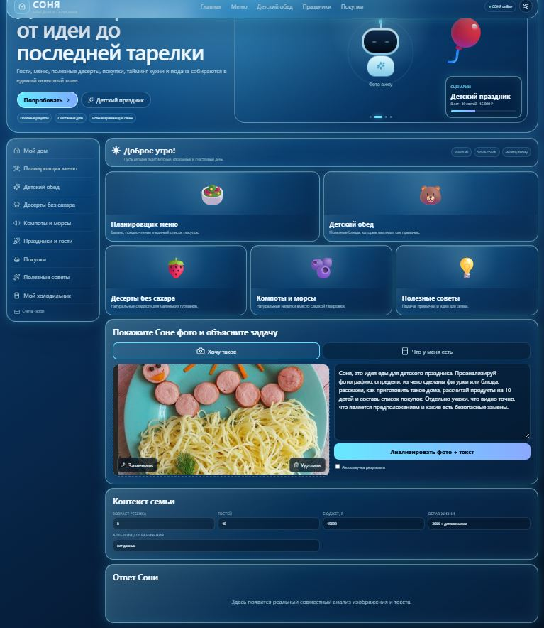
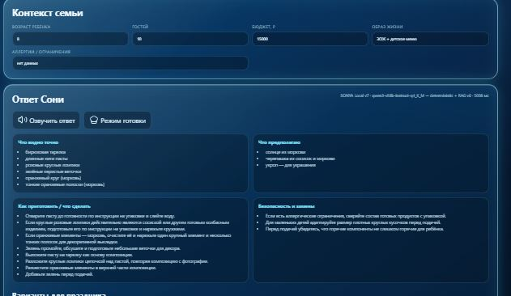
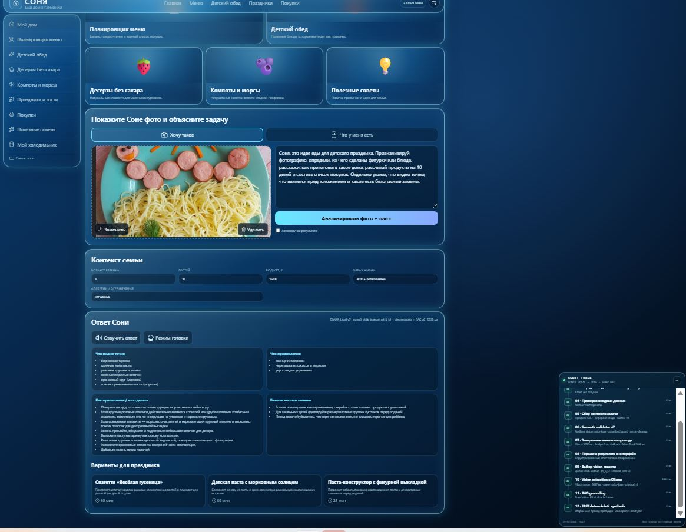
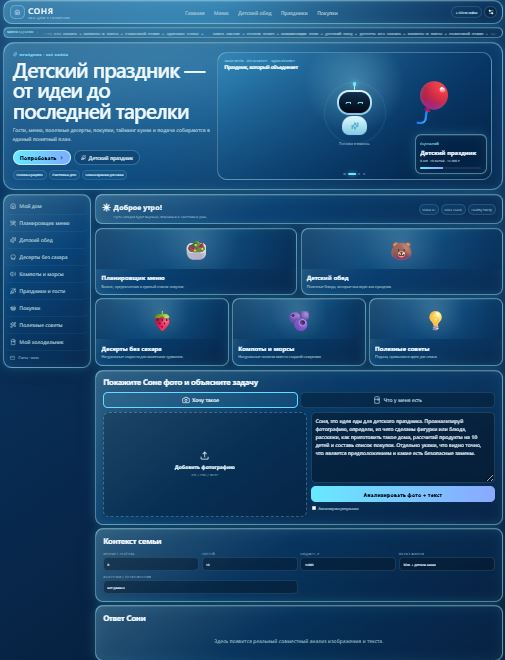
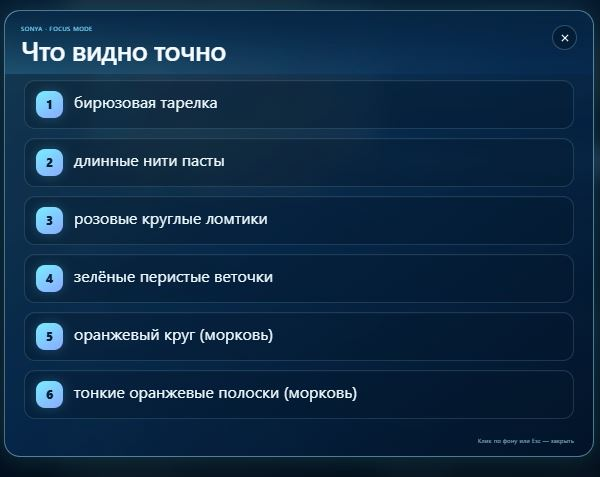
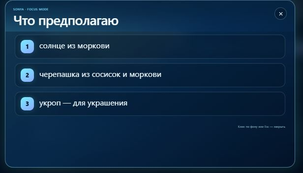
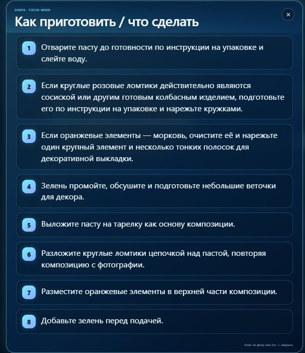
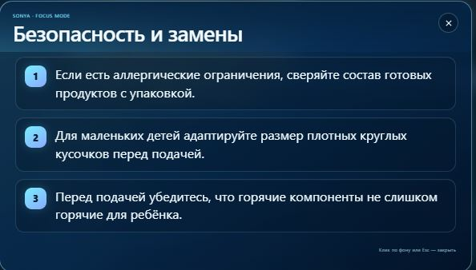

# ДЗ-17 · Мультимодальный анализатор контента

## SONYA Home Manager · домашний AI-управляющий

> Учебная задача: создать приложение, которое совместно обрабатывает **изображение + текстовый запрос** и превращает результат анализа в понятный пользовательский интерфейс.
>
> Итоговая реализация выросла в продуктовый прототип **SONYA Home Manager** — семейного AI-помощника для питания, покупок, событий и домашней организации.

[](SONYA_HOME_MANAGER/README.md)
[](SONYA_HOME_MANAGER/README.md)
[](#статус-сдачи)

---

# Live Demo

**Публичное приложение SONYA Home Manager:**  
https://sonya-home-manager-nujl7e.v2.appdeploy.ai/

Полная документация продукта:  
➡️ [`SONYA_HOME_MANAGER/README.md`](SONYA_HOME_MANAGER/README.md)

Видео-демонстрация:  
▶️ [`video/sonya-dz17-demo.mp4`](video/sonya-dz17-demo.mp4)

---

# Отчётность для сдачи

## 1. Ссылка на приложение

**SONYA Home Manager:**  
https://sonya-home-manager-nujl7e.v2.appdeploy.ai/

Приложение опубликовано как публичная web-версия и предназначено для открытия по ссылке без локального запуска проекта.

---

## 2. Скриншот одновременного анализа изображения и текста

На экране одновременно присутствуют:

- загруженное изображение;
- текстовый запрос пользователя;
- семейный контекст;
- запуск мультимодального анализа;
- структурированный результат SONYA.

### Фото + текстовый запрос



### Результат мультимодального анализа



### Трассировка реального агентного прохода



---

## 3. Ответы на вопросы задания

### Как была выстроена логика взаимодействия в вашем сценарии?

В качестве основного сценария выбран **детский праздник**. Пользователь может показать SONYA фотографию понравившегося блюда или продуктов и одновременно описать задачу обычным текстом.

Логика взаимодействия построена как последовательный мультимодальный pipeline:

```text
ФОТО
 +
ТЕКСТОВЫЙ ЗАПРОС
 +
КОНТЕКСТ СЕМЬИ / СОБЫТИЯ
        ↓
ПОДГОТОВКА ИЗОБРАЖЕНИЯ
        ↓
VISION-МОДЕЛЬ
        ↓
ФИЗИЧЕСКИЕ НАБЛЮДЕНИЯ
        ↓
ПРЕДПОЛОЖЕНИЯ ОБ ИНГРЕДИЕНТАХ И КОМПОЗИЦИИ
        ↓
RAG / ПРАВИЛА И КОНТЕКСТ
        ↓
СЕМАНТИЧЕСКАЯ ПРОВЕРКА
        ↓
СТРУКТУРИРОВАННЫЙ ОТВЕТ
        ↓
ПРИГОТОВЛЕНИЕ / БЕЗОПАСНОСТЬ / МЕНЮ / ПОКУПКИ
        ↓
ГОЛОСОВОЙ ПОШАГОВЫЙ РЕЖИМ
```

Интерфейс специально разделяет информацию на несколько уровней:

1. **«Что видно точно»** — только физические признаки изображения: цвет, форма, расположение, количество и визуально наблюдаемые элементы.
2. **«Что предполагаю»** — вероятная интерпретация объектов, например морковь, сосиска или укроп.
3. **«Как приготовить / что сделать»** — практические действия, которые можно выполнить дома.
4. **«Безопасность и замены»** — отдельный блок для детского сценария.
5. **«Варианты для праздника»** — развитие исходной идеи в несколько блюд.

Пользователь также задаёт контекст: возраст ребёнка, количество гостей, бюджет, образ жизни и пищевые ограничения. Поэтому одна и та же фотография может приводить к разному итоговому плану в зависимости от задачи пользователя.

После получения результата можно открыть каждую карточку в **Focus Mode**: основной сайт размывается, выбранный блок плавно увеличивается и становится удобным для чтения. Для приготовления предусмотрен отдельный голосовой режим с пошаговым алгоритмом `Назад → Повторить → Дальше`.

---

### С какими основными сложностями пришлось столкнуться при генерации стабильного и предсказуемого интерфейса? Каким образом вы их обошли?

Основная сложность оказалась не только в создании красивого интерфейса, но и в том, что мультимодальная модель может по-разному интерпретировать одно и то же изображение и иногда возвращать нестабильную структуру ответа.

Во время тестирования были обнаружены реальные примеры таких ошибок: модель могла назвать **морковь картофелем**, описать **бирюзовую тарелку как голубую**, смешать физическое наблюдение с предположением или вернуть повреждённый JSON. Если напрямую выводить такой ответ в UI, интерфейс становится непредсказуемым.

Для стабилизации была введена многоуровневая архитектура:

```text
Vision output
   ↓
строгий JSON contract
   ↓
loose JSON repair
   ↓
broken JSON salvage
   ↓
semantic reconstruction
   ↓
RAG grounding
   ↓
semantic validator
   ↓
stable UI schema
```

Использованы следующие решения:

- **фиксированная схема данных** вместо вывода произвольного текста модели;
- разделение `observation` и `assumptions`, чтобы предположение не выглядело установленным фактом;
- отдельные правила visual grounding для цвета, формы и типичных пищевых объектов;
- semantic validator, который устраняет дубли, пустые элементы и известные противоречия;
- резервный parser: даже если vision-модель вернула синтаксически повреждённый JSON, весь пользовательский сценарий больше не должен завершаться ошибкой;
- детерминированный профиль `FAST`, где после vision-прохода итоговый ответ можно собрать без второго LLM-вызова;
- **Agent Trace**, который показывает реальные технические этапы выполнения и помогает быстро понять, где именно произошёл сбой;
- Focus Mode и Cooking Mode вынесены в отдельные UI-компоненты, поэтому они не вмешиваются в основную логику мультимодального анализа;
- для нестабильных визуальных кейсов начата идея собственного regression corpus: найденная ошибка становится тест-кейсом для последующих версий.

Отдельной задачей была визуальная стабильность. Интерфейс проектировался не как обычный чат, а как самостоятельный household-product. Поэтому результат AI всегда раскладывается в одни и те же карточки, а дополнительные режимы открываются поверх страницы и не разрушают основную сетку.

Таким образом, стабильность обеспечивается не ожиданием того, что LLM всегда вернёт идеальный ответ, а **защитным слоем между генеративной моделью и пользовательским интерфейсом**.

---

# Что реализовано

- реальный совместный `image + text` анализ;
- загрузка фотографий `JPG / PNG / WEBP`;
- режим **«Хочу такое»**;
- режим **«Что у меня есть»**;
- семейный контекст: ребёнок, гости, бюджет, предпочтения, ограничения;
- разделение наблюдений и предположений;
- рекомендации по приготовлению;
- безопасность и замены;
- варианты блюд для праздника;
- список покупок;
- анимированная SONYA;
- голосовая озвучка;
- пошаговый Cooking Coach;
- Focus Mode с увеличенными стеклянными карточками;
- Agent Trace;
- responsive UI для desktop / tablet / mobile;
- локальный R&D-контур с Qwen3-VL через Ollama;
- устойчивый Vision pipeline с fallback-парсингом и semantic validation.

---

# Скриншоты

## Главный экран



## Фото + текст


## Результат SONYA


## Focus Mode · что видно точно



## Focus Mode · предположения



## Focus Mode · приготовление



## Безопасность



## Варианты для праздника


## Agent Trace


---

# Видео

Полная демонстрация интерфейса:

▶️ **[`sonya-dz17-demo.mp4`](video/sonya-dz17-demo.mp4)**

Видео показывает основной пользовательский путь: интерфейс → фотография → текстовый запрос → мультимодальный анализ → структурированный ответ → дополнительные режимы SONYA.

---

# Архитектура сценария

```text
Browser / Desktop / Tablet
          ↓
    SONYA Premium UI
          ↓
 Фото + текст + контекст
          ↓
  Image preprocessing
          ↓
     Vision Model
          ↓
 Resilient Vision Contract
          ↓
      RAG rules
          ↓
  Semantic Validator
          ↓
  Structured Analysis
  ├─ observation
  ├─ assumptions
  ├─ preparation
  ├─ safety
  ├─ menu
  └─ shopping
          ↓
 Focus / Voice / Cooking UI
```

Ключевой принцип:

```text
НАБЛЮДЕНИЕ ≠ ПРЕДПОЛОЖЕНИЕ ≠ РЕШЕНИЕ ПОЛЬЗОВАТЕЛЯ
```

SONYA не должна выдавать догадку модели за установленный факт и не заявляет о реальной оплате, заказе или бронировании без соответствующей интеграции и подтверждения пользователя.

---

# Статус сдачи

- [x] публичная ссылка на приложение;
- [x] публичный web-интерфейс;
- [x] загрузка изображения;
- [x] текстовый запрос;
- [x] одновременный `image + text` анализ;
- [x] скриншот процесса и результата;
- [x] текстовый ответ о логике взаимодействия;
- [x] текстовый ответ о сложностях и способах их обхода;
- [x] индивидуальный UI;
- [x] голосовой режим;
- [x] финальные скриншоты;
- [x] видео-демонстрация.

**ДЗ-17 подготовлено к сдаче.**

---

## Дополнительные материалы

Основная продуктовая документация: [`SONYA_HOME_MANAGER/README.md`](SONYA_HOME_MANAGER/README.md).

В каталоге `DZ_17` также сохранены более ранние экспериментальные контуры ALINA и локальные R&D-исследования. Финальная реализация и витрина текущего задания — **SONYA Home Manager**.