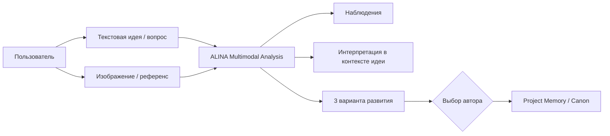

# ДЗ-17 · ALINA Multimodal Creative Producer

> **Тема:** Google AI Studio Build · мультимодальность в генеративных нейронных сетях  
> **Формат работы:** развитие ALINA / WILD_IDEAS вместо одноразового учебного «AI-Кулинара».

## Цель ДЗ

Собрать работающее веб-приложение, которое демонстрирует **совместную обработку текстового запроса и изображения**.

Учебный минимум ДЗ-17:

- загрузка изображения — **обязательна**;
- текстовый запрос — **обязателен**;
- одновременный анализ `image + text` — **обязателен**;
- голос — **опционален**;
- дизайн, системный промпт и логика могут быть индивидуальными;
- все функции должны быть протестированы;
- для сдачи нужны публичная ссылка, скриншот процесса анализа и краткий отчёт.

---

# Сценарий: ALINA Multimodal Creative Producer

ALINA — AI-продюсер творческих проектов. Пользователь передаёт ей идею и визуальный референс, а ALINA анализирует изображение **в контексте пользовательской задачи**, а не просто описывает картинку.

Пример:

> «Я хочу сделать сцену для книги. Проанализируй этот визуальный референс и предложи, что из него можно использовать».

ALINA должна:

1. определить наблюдаемые элементы изображения;
2. отдельно описать визуальное настроение и композицию;
3. сопоставить изображение с текстовой задачей пользователя;
4. предложить **3 разных направления развития**;
5. для каждого варианта показать сильную сторону и риск;
6. не принимать ключевое творческое решение вместо автора;
7. после выбора пользователя продолжить работу с утверждённым вариантом.

---

## Базовый workflow



### Главный принцип

```text
OBSERVATION ≠ INTERPRETATION ≠ AUTHOR DECISION
```

Пример:

```text
OBSERVATION
На изображении видны рыба, овощи, зелень, масло и специи.

INTERPRETATION
Композиция может поддерживать тему свежести, средиземноморской кухни и путешествия.

AUTHOR DECISION
Использовать изображение как референс сцены ужина у моря.
```

---

# Интерфейс

## Раздел 1 · Идея

- поле «Опишите задачу или идею»;
- тип проекта: книга / сценарий / комикс / видео;
- жанр;
- задача текущего шага.

## Раздел 2 · Визуальный референс

- загрузка изображения;
- Preview;
- комментарий пользователя;
- кнопка `Анализировать вместе с идеей`.

## Раздел 3 · Результат ALINA

- `Что я вижу`;
- `Как это связано с вашей задачей`;
- три карточки вариантов;
- сильная сторона;
- возможный риск;
- кнопка `Выбрать`;
- следующий вопрос ALINA после подтверждения.

---

# System Prompt

Полная версия находится в [`SYSTEM_PROMPT_ALINA.md`](SYSTEM_PROMPT_ALINA.md).

Ключевой цикл:

```text
UNDERSTAND
→ OBSERVE
→ INTERPRET
→ PROPOSE
→ CONFIRM
→ SAVE
```

ALINA обязана отделять наблюдаемые признаки изображения от творческой интерпретации и не изменять утверждённые решения автора без подтверждения.

---

# Тестирование

Полный чек-лист: [`TEST_PLAN.md`](TEST_PLAN.md).

Минимум перед сдачей:

- [ ] текст без изображения корректно обрабатывается или запрашивается изображение;
- [ ] изображение без текста корректно анализируется;
- [ ] изображение + текст анализируются совместно;
- [ ] ALINA не выдумывает объекты, которых явно нет на изображении;
- [ ] вывод разделён на наблюдение и интерпретацию;
- [ ] выдаются 3 варианта;
- [ ] выбор пользователя сохраняется как отдельное решение;
- [ ] интерфейс не ломается на desktop/mobile;
- [ ] ошибки загрузки изображения обработаны;
- [ ] секреты модели не находятся во frontend-коде.

---

# Что необходимо сдать

| Требование | Артефакт | Статус |
|---|---|:---:|
| Публичная ссылка на приложение | `Share URL` | ⏳ |
| Публичный доступ проверен | открыть ссылку вне основной сессии | ⏳ |
| Скриншот `текст + изображение + ответ` | `screenshots/` | ⏳ |
| Описание логики взаимодействия | [`REPORT.md`](REPORT.md) | ✅ |
| Описание основных сложностей и решения | [`REPORT.md`](REPORT.md) | ✅ |
| Функциональное тестирование | [`TEST_PLAN.md`](TEST_PLAN.md) | 🟡 |

> Публичный URL и финальный скриншот добавляются после запуска доступной среды выполнения. Если Google AI Studio недоступен по ограничениям платформы, реализация сохраняет учебные требования и может быть развёрнута на согласованной альтернативной модели/платформе.

---

# Расширение сверх учебного задания

ДЗ-17 рассматривается как **P0 мультимодального слоя ALINA**, а не отдельная демонстрация.

```text
ДЗ-16
ALINA TEXT
идея → 3 варианта → выбор автора

        ↓

ДЗ-17
ALINA MULTIMODAL
текст + изображение → наблюдение → интерпретация → 3 варианта

        ↓

ALINA PRODUCTION
Narrative KB
+ Project Memory
+ Story DNA
+ Visual Identity
+ Image Continuity
+ Storyboard
+ Animation
+ Voice / Audio / Video
```

Следующий продуктовый слой — структурированная Narrative Knowledge Base: миры, серии, проекты, персонажи, сцены, диалоги, знания персонажей, timeline, canon и visual continuity.

---

# Безопасность

- API-ключи не хардкодятся;
- секреты хранятся только в env/secrets/server-side;
- frontend не должен содержать реальные API keys;
- пользовательские изображения не трактуются как канонические факты без подтверждения автора;
- автоматические выводы ALINA сначала имеют статус `proposed`.

---

# Структура каталога

```text
DZ_17/
├── README.md
├── SYSTEM_PROMPT_ALINA.md
├── TEST_PLAN.md
├── REPORT.md
└── screenshots/
    └── README.md
```

---

## Definition of Done

ДЗ-17 считается готовым к отправке преподавателю, когда:

1. приложение открывается по публичной ссылке;
2. пользователь загружает изображение;
3. вводит текстовую задачу;
4. ALINA совместно анализирует текст и изображение;
5. результат отображается в интерфейсе;
6. сделан скриншот этого процесса;
7. все обязательные тесты пройдены;
8. `REPORT.md` приложен к работе.
