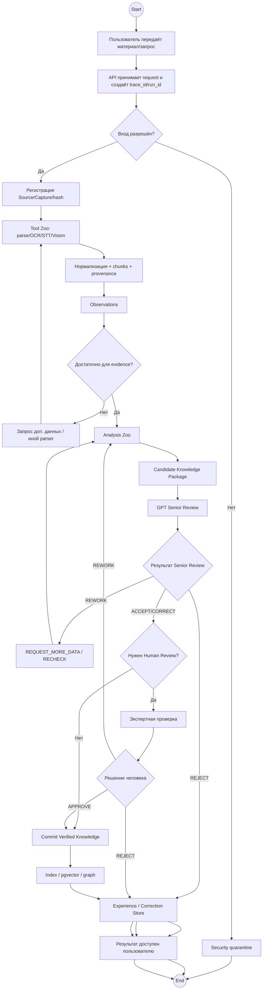

# ALINA Analyst Core — сквозной бизнес-процесс в BPMN-логике

> BPMN 2.0 используется как дополнительная инженерная нотация для последовательности, ролей, gateway и исключений. Функциональная нормативно-ориентированная декомпозиция дана отдельно в IDEF0.

## 1. Pools / Lanes

Основной процесс разделён на дорожки ответственности:

```text
POOL: ALINA ANALYST CORE

LANE 1 — Пользователь / Analyst
LANE 2 — Web UI / API Gateway
LANE 3 — Tool Zoo
LANE 4 — Analysis Zoo
LANE 5 — GPT Senior Analyst
LANE 6 — Human Reviewer
LANE 7 — Knowledge Base
LANE 8 — Administrator / Operations
LANE 9 — ИБ-специалист
```

## 2. Сквозной процесс



## 3. Сообщения между дорожками

### Пользователь → API

```json
{
  "request_id": "REQ-...",
  "workspace_id": "WS-...",
  "profile": "narrative",
  "source": {"type":"file|url|text|image|audio|video"},
  "requested_operation": "analyze",
  "options": {}
}
```

### API → Tool Zoo

```json
{
  "job_id": "JOB-...",
  "source_id": "SRC-...",
  "capture_id": "CAP-...",
  "tool_route": ["parser","ocr","stt","vision"],
  "policy_version": "...",
  "trace_id": "TRACE-..."
}
```

### Tool Zoo → Analysis Zoo

Передаётся не исходный «хаос», а нормализованный пакет:

```json
{
  "source_id": "SRC-...",
  "fragments": ["FRG-..."],
  "observations": ["OBS-..."],
  "provenance_index": {},
  "quality": {},
  "trace_id": "TRACE-..."
}
```

### Analysis Zoo → GPT Senior

Передаётся `Candidate Knowledge Package` версии `alina-candidate-package-v1`.

### GPT Senior → Orchestrator

```json
{
  "review_id": "REV-...",
  "decision": "accept|accept_with_corrections|reject|request_more_data|human_review",
  "corrections": [],
  "contradictions": [],
  "open_questions": [],
  "confidence": 0.0,
  "reasoning_summary": "...",
  "requested_evidence": []
}
```

### Orchestrator → Human Reviewer

Только спорные/high-impact элементы + ссылки на исходники и сравнение Local vs Senior.

### Human Reviewer → KB

```json
{
  "decision_id": "HREV-...",
  "approved": ["CAND-..."],
  "rejected": ["CAND-..."],
  "edited": [],
  "comment": "...",
  "reviewer_id": "USR-..."
}
```

---

# 4. Boundary/Error events

## E1 — Parser failure

Действие:

```text
PROCESSING → ERROR
retry <= policy.max_retries
если retry исчерпан → ADMIN ALERT
```

## E2 — Model timeout

```text
PROCESSING → WARNING
→ fallback model
→ если fallback failed → ERROR
```

## E3 — Security finding

```text
любой статус → BLOCKED
→ SEC EVENT
→ ИБ-специалист
→ allow / quarantine / reject
```

## E4 — Schema validation failed

```text
output rejected
→ same stage REWORK
→ alternate model/tool if configured
```

## E5 — Provenance missing

Кандидат не может перейти в `VERIFIED/PUBLISHED`; создаётся high severity quality finding.

## E6 — Local vs Senior disagreement

Автоматически создаётся `REVIEW_REQUIRED`; скрытое авторазрешение запрещено.

---

# 5. SLA timers

Каждый процессный узел может иметь timer event:

```text
queued_too_long
processing_timeout
external_llm_timeout
human_review_overdue
security_hold_overdue
```

Timer event создаёт warning/alert и отображается в Admin panel.

---

# 6. Компенсационные действия

Для необратимых операций предусмотрены compensation actions:

```text
Publish KB → create superseding version / rollback pointer
Model route change → restore previous config version
Domain Profile publish → revert to previous approved profile
Access grant → revoke
Export → revoke link where supported + incident record if leakage suspected
```

Физическое удаление истории проверки не используется как штатный способ исправления; изменения версионируются и журналируются.
