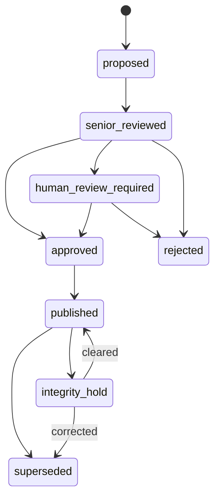
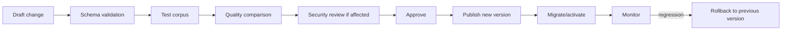

# ALINA Analyst Core — жизненный цикл Knowledge Base, Domain Profile и моделей

## 1. Knowledge Base lifecycle

### Состояния записи знания



### Правила

- `proposed` не используется как подтверждённый факт;
- `approved` ещё не обязательно опубликован;
- `published` обязан иметь полный provenance;
- исправление `published` создаёт новую запись/версию и `supersedes` старую;
- физическое удаление исторического знания не используется для обычной коррекции;
- integrity/security hold не уничтожает запись, а ограничивает использование.

### Процесс публикации

```text
Candidate
→ Senior Review
→ Human Review if policy requires
→ Publication schema validation
→ Provenance validation
→ Security/integrity validation
→ Transaction commit
→ Index update
→ Graph update
→ Embedding update
→ Version event
→ Audit event
```

---

# 2. Domain Profile lifecycle

Domain Profile определяет специальность Analyst Core.

Состояния:

```text
DRAFT
→ VALIDATING
→ APPROVED
→ ACTIVE
→ DEPRECATED
→ RETIRED
```

Profile package включает:

```text
ontology
entity_types
relation_types
event_types
required_analysts
optional_analysts
validators
evidence_rules
confidence_thresholds
model_routes
prompts
schemas
security/data-class rules
UI field/view configuration
```

Процесс изменения:



Новая версия профиля не должна silently reinterpret старые verified records. При необходимости выполняется отдельная migration/reanalysis campaign с traceable результатом.

---

# 3. Model lifecycle

Состояния модели:

```text
DISCOVERED
→ HASHED
→ SECURITY_REVIEW
→ BENCHMARKING
→ APPROVED
→ ACTIVE
→ DEGRADED
→ RESTRICTED
→ DISABLED
→ RETIRED
```

## Регистрация локальной модели

```text
file discovered
→ calculate SHA-256
→ read metadata
→ classify capabilities
→ security/source review
→ benchmark against domain test set
→ approve/reject
→ add to routing registry
```

## Метрики модели

```text
latency
throughput
VRAM peak
RAM peak
schema-valid rate
retry rate
Senior correction rate
Senior rejection rate
human correction rate
security finding rate
cost for external providers
availability
```

## Автоматическое снижение доверия

Пример policy:

```text
if schema_valid_rate < threshold
or senior_rejection_rate grows above threshold
or security_findings high
or model_integrity != ok
then
  model_state = DEGRADED or RESTRICTED
  remove from AUTO primary route
  notify Admin/IB
```

---

# 4. Routing lifecycle

Routing policy версионируется отдельно.

Пример:

```yaml
entity_extract:
  primary: local:text-fast
  fallback:
    - local:text-deep
    - gigachat:default

vision:
  primary: local:vision
  fallback:
    - gigachat:vision

senior_review:
  primary: gpt:senior
  fallback:
    - gigachat:deep
```

Изменение route:

```text
proposal
→ benchmark
→ capacity check
→ security check
→ approve
→ canary
→ activate
→ monitor
→ rollback if regression
```

---

# 5. Experience Store lifecycle

```text
LOCAL RESULT
+ GPT SENIOR RESULT
+ HUMAN RESULT
        ↓
DIFF
        ↓
ERROR CLASSIFICATION
        ↓
EXPERIENCE RECORD
        ↓
BENCHMARK / FEW-SHOT / RULE CANDIDATE
        ↓
TEST
        ↓
APPROVED IMPROVEMENT
```

Типы ошибок:

```text
entity_missed
entity_merged_wrong
claim_as_fact
relation_wrong
causality_wrong
timeline_wrong
knowledge_leak
visual_state_wrong
provenance_missing
contradiction_missed
unsupported_inference
schema_failure
security_policy_failure
```

---

# 6. Branching / versions knowledge

Для Narrative и других областей возможны branches/scopes:

```text
UNIVERSE
├─ CANON / MAIN
├─ ALTERNATE
└─ ADAPTATION
```

Knowledge record содержит:

```text
workspace_id
domain_profile_id
kb_id
branch_id
scope_type
scope_id
valid_from / valid_to where applicable
version
supersedes_id
```

Никакое автоматическое объединение conflicting branches не допускается.

---

# 7. Backup / restore / integrity

KB backup должен сохранять согласованный snapshot:

```text
PostgreSQL state
object/source references
schema versions
Domain Profile versions
model/routing versions used for runs
Audit/Event Ledger
```

Restore procedure:

```text
restore staging
→ DB integrity
→ provenance integrity
→ object/hash validation
→ index rebuild
→ sample query validation
→ security sign-off for production restore
```

---

# 8. API lifecycles

```text
GET  /api/kb/{kb_id}/versions
POST /api/kb/{kb_id}/publish
POST /api/kb/{kb_id}/records/{id}/supersede
POST /api/kb/{kb_id}/integrity-check

GET  /api/profiles
POST /api/profiles
POST /api/profiles/{id}/validate
POST /api/profiles/{id}/publish
POST /api/profiles/{id}/activate

GET  /api/models
POST /api/models/discover
POST /api/models/{id}/benchmark
POST /api/models/{id}/approve
POST /api/models/{id}/disable

GET  /api/routes
POST /api/routes/test
POST /api/routes/publish
POST /api/routes/rollback
```
