# ALINA Analyst Core — каталог процессов

## 1. Классификация процессов

Процессы разделены на четыре группы: `M` — управляющие, `P` — основные, `S` — обеспечивающие, `SEC` — процессы ИБ и защиты AI/KB.

## 2. Управляющие процессы

| ID | Процесс | Цель | Основной результат |
|---|---|---|---|
| M1 | Управление стратегией продукта | Определять цели, границы, приоритеты Analyst Core | Roadmap, scope, приоритеты |
| M2 | Управление Domain Profiles | Создавать и версионировать предметные профили | Ontology/profile package |
| M3 | Управление моделями и маршрутизацией | Назначать локальные/внешние модели по ролям | Routing policy, model registry |
| M4 | Управление качеством | Определять критерии точности и review | Quality policy, thresholds |
| M5 | Управление метриками и SLA/SLO | Контролировать производительность и доступность | KPI/SLO dashboard |
| M6 | Управление ИБ и AI-risk | Определять защитные политики и риски | Security policy, risk register |
| M7 | Управление доступом | RBAC/ABAC, роли, разрешения, сегментация KB | Access policy |
| M8 | Управление изменениями и конфигурациями | Контролировать версии кода, схем, профилей, моделей | Approved configuration |
| M9 | Управление релизами | Планировать ввод изменений | Release package |
| M10 | Управление заинтересованными сторонами | Коммуникация, требования, обучение | Stakeholder register |

## 3. Основные процессы

| ID | Процесс | Вход | Выход |
|---|---|---|---|
| P1 | Приём материала/запроса | Файл, URL, текст, изображение, аудио, видео, OSINT-пакет | Intake request |
| P2 | Регистрация источника | Intake request | Source + Capture + hash |
| P3 | Классификация источника | Source | Тип, профиль, уровень доверия, policy flags |
| P4 | Проверка входа | Source | Accepted / quarantined / rejected |
| P5 | Ingest / Parsing | Capture | Extracted raw content |
| P6 | OCR / STT / Vision pre-pass | Изображение/аудио/видео | Machine observations |
| P7 | Нормализация | Raw content | Normalized content |
| P8 | Chunking / segmentation | Normalized content | Fragments/chunks |
| P9 | Первичные observations | Fragments | Observation records |
| P10 | Evidence qualification | Observations | Evidence candidates/accepted evidence |
| P11 | Entity extraction | Evidence | Entity candidates |
| P12 | Claim extraction | Evidence | Claim candidates |
| P13 | Fact candidate extraction | Evidence/claims | Fact candidates |
| P14 | Relation extraction | Entities/facts | Relation candidates |
| P15 | Event extraction | Evidence | Event candidates |
| P16 | Timeline construction | Events | Timeline candidates |
| P17 | Knowledge-state analysis | Claims/events/dialogues | Кто что знает/считает/слышал |
| P18 | Dialogue analysis | Dialogue fragments | Speaker/listener/utterance claims |
| P19 | Cause/effect analysis | Events/facts | Causal candidates |
| P20 | Contradiction analysis | Candidates + KB | Contradictions |
| P21 | Hypothesis construction | Evidence + contradictions | Hypotheses |
| P22 | Counter-evidence search | Hypothesis/candidate | Counter-evidence package |
| P23 | Cross-document analysis | Multi-source evidence | Merged/compared candidates |
| P24 | Narrative Drift / media manipulation analysis | Claims/media chain | Drift map / manipulation findings |
| P25 | Visual continuity analysis | Images + narrative state | Visual-state candidates/conflicts |
| P26 | Candidate Knowledge Package assembly | Все candidates | Candidate Knowledge Package |
| P27 | GPT Senior Review | Candidate package | accept/reject/correct/ask/recheck |
| P28 | Rework / additional acquisition | Senior feedback | Enriched candidate package |
| P29 | Human Review | Senior-reviewed package | Approved/rejected/edited decisions |
| P30 | Publish to KB | Approved records | Verified knowledge records |
| P31 | Index / embed / graph update | Verified records | Search/vector/graph indexes |
| P32 | Query / retrieval | User query | Evidence-backed answer |
| P33 | Report generation | Query/case/KB | Report/export |
| P34 | Experience capture | Local result + corrections | Experience record |
| P35 | Rule/prompt/routing improvement | Experience corpus | Updated rules/prompts/routes |

## 4. Обеспечивающие процессы

| ID | Процесс | Назначение |
|---|---|---|
| S1 | Управление инфраструктурой | Локальные сервисы, серверы, БД, файловое хранилище |
| S2 | Queue / Scheduler | Приоритеты, параллелизм, retries, resource semaphores |
| S3 | Model Runtime | llama.cpp/GGUF, загрузка/выгрузка моделей |
| S4 | External LLM Connectivity | GigaChat/OpenAI-compatible providers |
| S5 | Мониторинг и телеметрия | CPU/GPU/RAM, throughput, latency, errors |
| S6 | Логи и трассировка | trace_id, event log, structured logs |
| S7 | Backup / Restore | БД, object storage, config, profiles |
| S8 | CI/CD | Сборка, тесты, проверки, релиз |
| S9 | Управление схемами | JSON Schema, DB migrations, versioning |
| S10 | Управление секретами | API keys, tokens, credentials |
| S11 | Пользовательская поддержка | Обращения, обучение, инструкции |
| S12 | Capacity Management | GPU/CPU/RAM budgets, quotas, saturation |
| S13 | Audit / Compliance | Журнал действий, контроль выполнения политик |

## 5. Процессы ИБ и защиты AI/KB

| ID | Процесс | Что защищает | Результат |
|---|---|---|---|
| SEC1 | Security Triage входных данных | Систему от вредоносных файлов/контента | allow/quarantine/block |
| SEC2 | Prompt Injection Detection | LLM-контур | injection finding |
| SEC3 | Data Poisoning Detection | Evidence/KB | poisoning suspicion / hold |
| SEC4 | Model Supply Chain Control | GGUF/models/adapters | trusted model record |
| SEC5 | Model Integrity Verification | Runtime model files | hash/signature status |
| SEC6 | Secret Leakage Prevention | Prompts/logs/exports | blocked/redacted secret |
| SEC7 | Access Control Review | UI/API/KB | RBAC/ABAC decision |
| SEC8 | KB Integrity Control | Published knowledge | integrity alert/version rollback |
| SEC9 | Provenance Integrity | Источники и доказательства | provenance verification |
| SEC10 | Security Monitoring | События AI/KB/runtime | security alert |
| SEC11 | Incident Response | Нарушения/атаки | contained/recovered incident |
| SEC12 | Vulnerability Management | Код/зависимости/runtime | remediation plan |
| SEC13 | AI Model Behavior Review | Аномальные ответы/дрейф | model risk finding |
| SEC14 | Export / Exfiltration Control | Выгрузки и ответы | policy decision |
| SEC15 | Audit Review | Полнота действий и изменений | audit finding |

## 6. Карточка процесса — обязательный шаблон

Для каждого процесса в реализации создаётся карточка:

```yaml
process_id: Pxx
name: string
owner_role: string
purpose: string
trigger: string
inputs: []
outputs: []
controls: []
mechanisms: []
preconditions: []
postconditions: []
states: []
api_endpoints: []
artifacts: []
security_controls: []
kpi: []
slo: []
errors: []
escalation: []
version: semver
```

## 7. Сквозной основной процесс

```mermaid
flowchart LR
 P1[Приём]-->P2[Регистрация]-->P4[Security Triage]-->P5[Ingest]
 P5-->P7[Нормализация]-->P8[Chunks]-->P9[Observations]-->P10[Evidence]
 P10-->P11[Entities]
 P10-->P12[Claims]
 P10-->P15[Events]
 P11-->P14[Relations]
 P12-->P13[Fact candidates]
 P13-->P20[Contradictions]
 P15-->P16[Timeline]
 P20-->P21[Hypotheses]
 P21-->P22[Counter-evidence]
 P14-->P26[Candidate Package]
 P16-->P26
 P22-->P26
 P26-->P27[GPT Senior]
 P27--rework-->P28[Доп. анализ/добыча]
 P28-->P26
 P27--review needed-->P29[Human Review]
 P27--safe approval-->P30[Publish KB]
 P29--approved-->P30
 P30-->P31[Index/Graph]
 P31-->P32[Query]
 P30-->P34[Experience]
 P27-->P34
 P34-->P35[Improve rules/routes]
```


