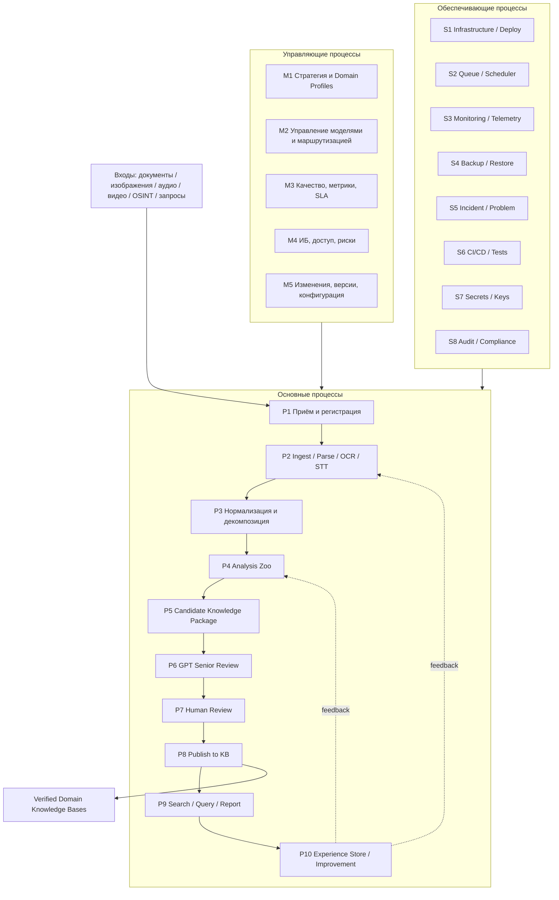

# ALINA Analyst Core — комплект бизнес-процессов

Этот каталог фиксирует полную процессную архитектуру ALINA Analyst Core: от поступления исходного материала до публикации проверенного знания, эксплуатации моделей, ИБ-контроля, обработки ошибок и накопления опыта.

## Нормативная и методическая основа

Для оформления используются несколько уровней представления. **IDEF0** применяется как основная функциональная модель в логике ГОСТ Р 50.1.028-2001: входы, управления, выходы и механизмы (ICOM), контекст A-0 и декомпозиция A0/A1…An. Структура требований и проектной документации согласуется с подходом ГОСТ 34.602-2020 и ГОСТ 34.201-2020. Процессный подход, измеримость и постоянное улучшение согласуются с ГОСТ Р ИСО 9001-2015. Контроль доступа, аудит, управление инцидентами и защита данных проектируются в логике СУИБ и требований ГОСТ Р ИСО/МЭК 27001.

**BPMN 2.0, C4 и Mermaid не являются ГОСТ-нотациями** и используются дополнительно: BPMN — для исполняемой логики и дорожек ответственности, C4 — для архитектуры ПО, Mermaid — как воспроизводимый исходный формат схем в Git.

## Состав комплекта

| Документ | Назначение |
|---|---|
| `PROCESS_CATALOG.md` | Реестр всех управляющих, основных, обеспечивающих и ИБ-процессов |
| `IDEF0_MODEL.md` | Контекст A-0 и декомпозиция A0/A1…A6, ICOM |
| `BPMN_MAIN_PROCESS.md` | Сквозной процесс `источник → verified KB` с дорожками ролей |
| `STATUS_AND_INCIDENTS.md` | Цвета, состояния, события, ошибки, retry, уведомления |
| `ROLE_PANELS_AND_RBAC.md` | Панели Пользователь / Администратор / ИБ-специалист / Эксперт |
| `AI_SECURITY_PROCESS.md` | Защита AI-систем, моделей, входных данных и баз знаний |
| `KB_AND_MODEL_LIFECYCLE.md` | Жизненный цикл KB, Domain Profiles и моделей |
| `RACI_AND_KPI.md` | Ответственность, KPI, SLA/SLO и процессная телеметрия |
| `../API_CONTRACTS.md` | Контракты API и передача артефактов между этапами |
| `../ANALYST_CORE_P0.md` | P0-реализация Analyst Core |
| `../ANALYST_CORE_TZ.md` | Генеральное ТЗ |

## Карта верхнего уровня



## Базовый принцип трассировки

Каждый шаг создаёт событие и артефакт. Ни один процесс не должен передавать «невидимый» результат.

```text
SOURCE
→ CAPTURE
→ FRAGMENT
→ OBSERVATION
→ EVIDENCE
→ CLAIM / FACT / RELATION / EVENT CANDIDATE
→ CANDIDATE KNOWLEDGE PACKAGE
→ SENIOR REVIEW
→ HUMAN REVIEW (если требуется)
→ VERIFIED RECORD
→ KNOWLEDGE BASE
→ EXPERIENCE / CORRECTION STORE
```

Каждый артефакт имеет `id`, `schema_version`, `status`, `provenance`, `created_at`, `producer/tool/model`, `input_refs`, `output_refs` и `trace_id`.

## Правило визуализации на сайте ALINA

Любой пользователь с доступом к задаче видит живую карту процесса. Цвет узла отображает состояние; клик по узлу открывает вход, выход, модель/инструмент, метрики, provenance, журнал событий и ошибку.

```text
СВЕТЛО-СИНИЙ  RECEIVED / REGISTERED
СИНИЙ         QUEUED
ЖЁЛТЫЙ        PROCESSING
ФИОЛЕТОВЫЙ    HANDOFF / TRANSFER
БИРЮЗОВЫЙ     REVIEW
ЗЕЛЁНЫЙ       READY / COMPLETED / APPROVED
ОРАНЖЕВЫЙ     WARNING / NEEDS ATTENTION
КРАСНЫЙ       ERROR
ТЁМНО-КРАСНЫЙ BLOCKED / SECURITY HOLD
СЕРЫЙ         SKIPPED / SUPERSEDED / DISABLED
```

Красный статус автоматически создаёт событие инцидента или технической ошибки согласно severity и правилам эскалации; критические ИБ-события направляются Администратору и ИБ-специалисту.
