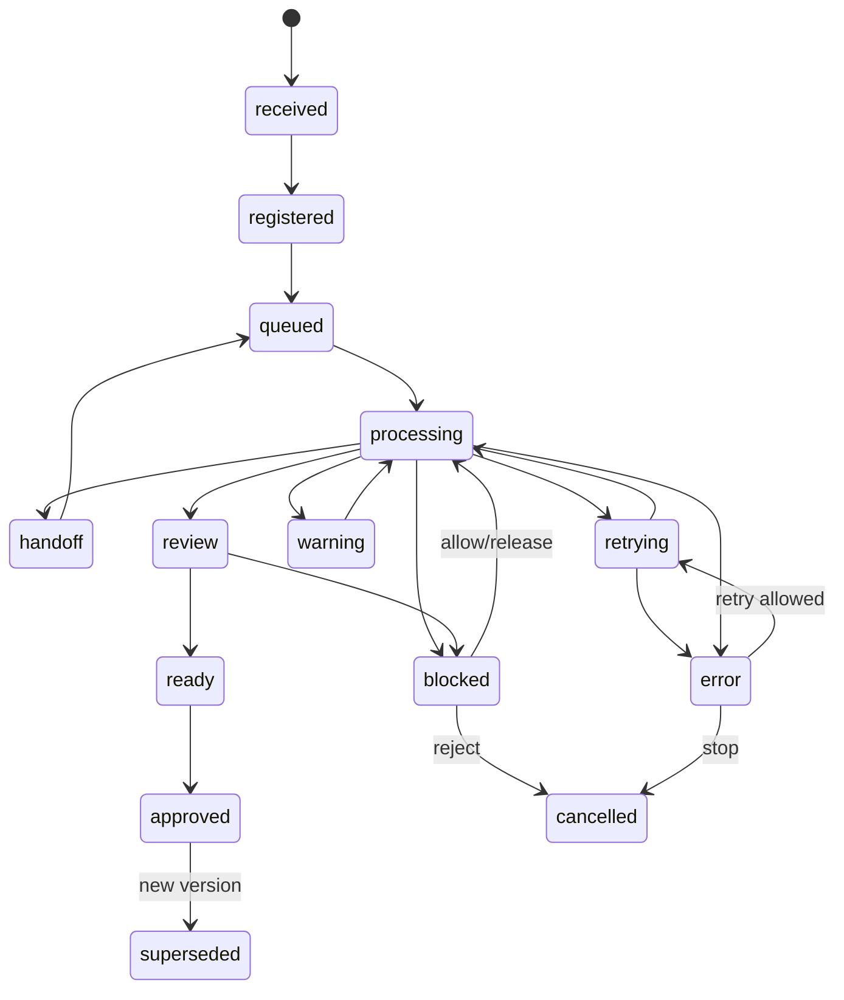
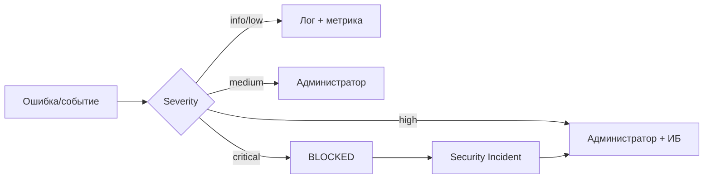

# ALINA Analyst Core — статусы, события, ошибки и инциденты

## 1. Назначение

Документ задаёт единый визуальный и машинный контракт состояний. Он используется в живой схеме сайта ALINA, API, журнале событий, панели администратора и панели ИБ.

## 2. Цветовая модель

| Status | Цвет UI | Смысл |
|---|---|---|
| `received` | светло-синий | информация поступила |
| `registered` | голубой | источник зарегистрирован |
| `queued` | синий | задача ожидает ресурса |
| `processing` | жёлтый | этап выполняется |
| `handoff` | фиолетовый | результат передаётся следующему этапу |
| `review` | бирюзовый | идёт проверка |
| `ready` | зелёный | этап успешно завершён |
| `approved` | зелёный насыщенный | знание утверждено |
| `warning` | оранжевый | проблема не блокирует весь поток |
| `retrying` | пурпурный | повторная попытка |
| `error` | красный | этап завершился ошибкой |
| `blocked` | тёмно-красный | security/policy hold |
| `cancelled` | серый | остановлено пользователем/админом |
| `skipped` | серый | этап не требовался |
| `superseded` | серый штрих | результат заменён новой версией |

## 3. State machine



## 4. Event schema

```json
{
  "event_id": "EVT-...",
  "trace_id": "TRACE-...",
  "run_id": "RUN-...",
  "job_id": "JOB-...",
  "stage_id": "P13",
  "stage_instance_id": "STG-...",
  "status_from": "processing",
  "status_to": "handoff",
  "severity": "info|low|medium|high|critical",
  "actor_type": "user|service|tool|model|admin|security|senior|human_reviewer",
  "actor_id": "...",
  "tool_id": "entity-extractor-v2",
  "model_id": "local:qwen-...",
  "input_refs": ["FRG-..."],
  "output_refs": ["CAND-..."],
  "message": "...",
  "error_code": null,
  "started_at": "ISO-8601",
  "finished_at": "ISO-8601",
  "latency_ms": 1234,
  "attempt": 1,
  "metadata": {}
}
```

## 5. Что видно при клике на узел процесса

Карточка этапа должна показывать:

```text
Process / Stage ID
Название
Текущий status + цвет
Время старта/завершения
Duration / queue wait
Входные артефакты
Выходные артефакты
Модель / инструмент / версия
Domain Profile
Confidence distribution
Provenance coverage
Attempts / retries
Логи
Ошибки
Security findings
Кому передано дальше
Trace ID
```

Для sensitive-полей применяется RBAC/redaction.

## 6. Severity matrix

| Severity | Пример | Реакция |
|---|---|---|
| info | штатный переход | только event log |
| low | единичный retry | log + metric |
| medium | fallback модели, частичный parser failure | Admin notification |
| high | потеря provenance, серия ошибок, подозрение poisoning | Admin + ИБ, hold для affected records |
| critical | leakage secret, compromise model/KB, unauthorized access | немедленный `blocked`, incident, Admin + ИБ |

## 7. Error taxonomy

```text
SRC_*    source/intake errors
PAR_*    parser/OCR/STT errors
MOD_*    model/runtime/API errors
SCH_*    schema validation errors
PRV_*    provenance errors
KB_*     storage/publication errors
SEC_*    security findings
ACL_*    authorization errors
NET_*    external connectivity
RES_*    CPU/GPU/RAM/resource exhaustion
Q_*      queue/scheduler errors
```

Примеры:

```text
MOD_TIMEOUT
MOD_CONTEXT_LIMIT
MOD_INVALID_JSON
PAR_UNSUPPORTED_FORMAT
PRV_MISSING_FRAGMENT
KB_VERSION_CONFLICT
SEC_PROMPT_INJECTION
SEC_DATA_POISONING
SEC_SECRET_DETECTED
ACL_DENIED
RES_GPU_OOM
```

## 8. Retry policy

Retry разрешается только для технически повторяемых ошибок.

```yaml
retry_policy:
  max_attempts: 3
  backoff: exponential
  retryable:
    - MOD_TIMEOUT
    - NET_TIMEOUT
    - NET_429
    - TEMP_STORAGE_UNAVAILABLE
  non_retryable:
    - ACL_DENIED
    - SEC_BLOCK
    - PAR_UNSUPPORTED_FORMAT
    - SCHEMA_POLICY_VIOLATION
```

При каждом retry создаётся новый event, но сохраняется один `trace_id`.

## 9. Эскалация



## 10. Уведомления

Администратор получает:

- repeated failures;
- queue saturation;
- model unavailable;
- DB/storage errors;
- SLO breach;
- exhausted retries.

ИБ-специалист получает:

- security triage block;
- prompt injection;
- poisoning suspicion;
- secret leakage;
- unauthorized access;
- model hash mismatch;
- KB integrity violation;
- suspicious export/exfiltration;
- audit gap.

Пользователь получает только безопасно сформулированный статус своей задачи и действия, которые от него требуются.

## 11. API для живой схемы

```text
GET  /api/runs/{run_id}
GET  /api/runs/{run_id}/stages
GET  /api/runs/{run_id}/events
GET  /api/runs/{run_id}/graph
POST /api/runs/{run_id}/cancel
POST /api/jobs/{job_id}/retry
```

Для live update:

```text
GET /api/runs/{run_id}/events/stream    # SSE
WS  /api/ws/runs/{run_id}               # optional WebSocket
```

Первым реализуется SSE: проще, достаточно для однонаправленного обновления статусов.
