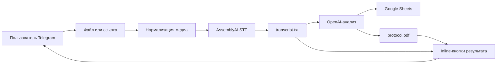

# ДЗ-5 · AI-секретарь встреч

> Интеграции: файлы, Google Sheets и внешние API

[](https://colab.research.google.com/github/VictorKVS/Vibe-coding/blob/agent/dz6-dz8-showcase-clean/DZ_5_Integrations_files,_Sheets,_external_APIs/notebooks/DZ5_AI_Secretary_TXT_Download.ipynb)
[](https://docs.aiogram.dev/)
[](scripts/verify_transcript_download.py)
[](#безопасность)

AI-секретарь принимает запись созвона, распознаёт речь, формирует результаты встречи и возвращает пользователю два независимых артефакта:

- **PDF-протокол** — саммари, задачи, ответственные и полный транскрипт;
- **TXT-транскрипт** — исходный распознанный текст созвона.

## Обязательный результат

После завершения обработки в одном сообщении Telegram появляются две inline-кнопки:

```text
┌──────────────────────────────┬───────────────────────────────┐
│ 📄 Скачать протокол (PDF)    │ 📝 Скачать транскрипт (TXT)   │
└──────────────────────────────┴───────────────────────────────┘
```

Каждая кнопка содержит `artifact_id` своего созвона. Поэтому кнопка отправляет файл именно той обработки, возле которой она показана. Если файл отсутствует, бот показывает понятный alert и не падает.

## Возможности

| Этап | Результат |
|---|---|
| Приём данных | аудио, voice, видео, video note, документ или публичная ссылка |
| Нормализация | извлечение звука и определение типа файла |
| Speech-to-Text | AssemblyAI, определение языка и пунктуация |
| Хранение | UTF-8 транскрипт в `transcripts/` |
| AI-анализ | саммари, задачи, ответственные, следующая встреча |
| Таблица | добавление структурированных строк в Google Sheets |
| Документ | PDF-протокол на русском языке |
| Выдача | отдельные кнопки PDF и TXT |
| Консультант | вопросы только по последнему транскрипту |

## Архитектура



## Требование → реализация → доказательство

| № | Требование | Реализация | Доказательство |
|---:|---|---|---|
| 1 | В одном сообщении две inline-кнопки | `kb_ready(artifact_id)` | скрин результата |
| 2 | Скачать PDF | callback `download_pdf:<id>` | PDF в Telegram |
| 3 | Скачать TXT | callback `download_txt:<id>` | TXT в Telegram |
| 4 | Файл относится к своему созвону | `ARTIFACT_STATE[artifact_id]` | две последовательные обработки |
| 5 | Понятная ошибка без исключения | Telegram alert с `show_alert=True` | отрицательный тест |
| 6 | Секреты не попадают в код | Colab Secrets | проверка Notebook |
| 7 | Публичный Notebook | готовый `.ipynb` | ссылка Google/Яндекс Диска |

## Структура проекта

```text
DZ_5_Integrations_files,_Sheets,_external_APIs/
├── README.md
├── COLAB_ONE_CELL.md
├── notebooks/
│   └── DZ5_AI_Secretary_TXT_Download.ipynb
├── scripts/
│   └── verify_transcript_download.py
├── src/
│   ├── app.py
│   ├── services.py
│   ├── media.py
│   └── ...
├── docs/
│   ├── ARCHITECTURE.md
│   ├── TELEGRAM_SCENARIO.md
│   └── UX_FLOW.md
└── assets/
    └── screens/
```

## Быстрая проверка

```powershell
Set-Location "DZ_5_Integrations_files,_Sheets,_external_APIs"
python scripts/verify_transcript_download.py
```

Ожидаемый результат:

```text
PASS DZ5-TXT-MIN: one result message contains PDF and TXT inline buttons
PASS DZ5-TXT-MED: every callback is bound to its artifact_id
PASS DZ5-TXT-MAX: missing transcript returns a safe Telegram alert
DZ-5 transcript download acceptance: 3/3 checks green.
```

## Запуск в Google Colab

1. Нажать **Open in Colab**.
2. Добавить секреты:
   - `TELEGRAM_BOT_TOKEN`;
   - `OPENAI_API_KEY`;
   - `ASSEMBLYAI_API_KEY`;
   - `GOOGLE_SERVICE_ACCOUNT_JSON`;
   - `GOOGLE_SHEETS_ID`.
3. Выполнить ячейки по порядку.
4. Открыть Telegram-бота и отправить короткую запись.
5. Проверить обе кнопки.

## Безопасность

- значения токенов не записываются в Notebook и Git;
- `transcripts/`, `protocols/` и runtime-файлы не публикуются;
- callback использует внутренний `artifact_id`, а не путь пользователя;
- отсутствие файла обрабатывается контролируемо;
- перед записью видео необходимо закрыть панель Colab Secrets и не показывать токены.

## Что сдаётся

- публичная ссылка на Jupyter Notebook в Google Диске или Яндекс Диске;
- скрин одного сообщения с двумя inline-кнопками;
- скрин скачанного PDF;
- скрин скачанного TXT;
- скрин понятной ошибки отсутствующего TXT;
- короткое видео полного сценария.

Полная карточка сдачи: [submissions/DZ-05](../submissions/DZ-05/README.md).
