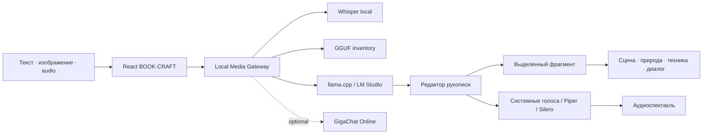

# ДЗ-8 · BOOK·CRAFT MEDIA STUDIO

> Продолжение ДЗ-6: текст, изображения и аудио в одном рабочем процессе.

[](../submissions/DZ-08/PRO/README.md)
[](#бесплатный-контур)
[](#безопасность)

Проект создан как отдельная копия стабильного BOOK·CRAFT из ДЗ-6. Исходная версия ДЗ-6 остаётся неизменной, а здесь развивается мультимодальная студия.

## Что переносится из ДЗ-6

- сценарий книги и видеоролика;
- пять жанров и редактируемая структура;
- инженерная карта мира и паспорта персонажей;
- локальная LLM и внешний Model Gateway;
- импорт, экспорт и автосохранение;
- подготовка иллюстрации по выбранному фрагменту.

## Что добавляет ДЗ-8

| Функция | Как работает | Стоимость | Этап |
|---|---|:---:|:---:|
| Голосовой запрос | audio → локальный STT → обычный user_message | 0 ₽ | backend MVP |
| Диктовка в редактор | микрофон заполняет поле команды или выбранный блок | 0 ₽ | следующий UI |
| Четыре голосовые роли | женщина, мужчина, девочка, мальчик; системные голоса + pitch/rate | 0 ₽ | следующий UI |
| Локальные модели | backend ищет GGUF в разрешённых папках и возвращает каталог | 0 ₽ | backend MVP |
| Онлайн GigaChat | отдельный профиль, выбор модели и временный token | по тарифу пользователя | опционально |
| Word-подобный редактор | итоговая рукопись, выделение, история правок, экспорт | 0 ₽ | следующий UI |
| Развитие фрагмента | выделение → сцена / природа / техника / диалог / конфликт | 0 ₽ локально | следующий UI |
| Аудиоспектакль | роли персонажей → реплики → дорожки → экспорт | 0 ₽ локально | roadmap |

## Архитектура



## Логика задания PRO

Backend принимает `multipart/form-data`:

- `session_id` — обязательный идентификатор;
- `user_message` — текст, может быть пустым;
- `history` — история;
- `image` — опциональное изображение;
- `audio` — опциональная запись.

Правило приоритета:

1. непустой `user_message` используется без STT;
2. при пустом тексте и наличии `audio` запускается распознавание;
3. расшифровка становится `user_message` и идёт в общий pipeline;
4. пустая расшифровка или ошибка возвращает понятный ответ без stack trace;
5. без текста и audio возвращается контролируемая ошибка 422.

## Бесплатный контур

Рекомендуемая конфигурация для Windows и RTX 3060 12 ГБ:

- генерация: существующий `llama-server` или LM Studio;
- STT: `whisper.cpp` с Whisper large-v3-turbo либо smaller-моделью для скорости;
- быстрый TTS: голоса Windows через Web Speech API;
- качественный русский TTS: Piper или Silero TTS локально;
- аудиосборка: FFmpeg;
- хранение: JSON/SQLite локально.

Детские роли в браузерном режиме — это ролевые пресеты высоты и скорости, а не имитация голоса реального ребёнка. Для стабильного качества позже подключается локальный Piper/Silero.

## Структура

```text
DZ_8_BOOKCRAFT_Media/
├── src/                     # React-копия BOOK·CRAFT
├── scripts/                 # проверки и Windows launcher
├── backend/
│   ├── app.py               # audio/STT и каталог локальных моделей
│   ├── requirements.txt
│   └── .env.example
├── tests/
│   └── test_media_contract.py
├── docs/
│   └── PRODUCT_PLAN.md
└── README.md
```

## Запуск основы интерфейса

```powershell
Set-Location "G:\1\Vibe coding\Vibe-coding\DZ_8_BOOKCRAFT_Media"
npm install
npm test
npm run build
npm run dev
```

## Запуск backend MVP

```powershell
Set-Location "G:\1\Vibe coding\Vibe-coding\DZ_8_BOOKCRAFT_Media"
py -m venv .venv
.\.venv\Scripts\Activate.ps1
pip install -r .\backend\requirements.txt
Copy-Item .\backend\.env.example .\.env
uvicorn backend.app:app --reload --port 8018
```

Проверка: `http://127.0.0.1:8018/api/health`.

## Безопасность

- token GigaChat вводится только на время открытой вкладки;
- token, API-ключи и Authorization не входят в localStorage и экспорт;
- backend читает секреты только из окружения;
- поиск моделей ограничивается списком разрешённых каталогов;
- исходные audio/image не публикуются;
- в Git не добавляются `.env`, модели, runtime, записи и готовые аудиодорожки.

## Дорожная карта приёмки

### MIN — обязательный PRO

- audio принимается вместе с прежними полями;
- пустой текст распознаётся;
- расшифровка становится user_message;
- ошибка STT безопасна.

### MED — полноценный media workflow

- диктовка в интерфейсе;
- каталог локальных моделей;
- Word-подобный редактор;
- действия над выделенным фрагментом;
- экспорт TXT/MD/JSON/DOCX.

### MAX — кузница аудиоспектаклей

- персонажам назначаются голосовые роли;
- сцены делятся на реплики и ремарки;
- TTS генерирует отдельные дорожки;
- FFmpeg собирает сцену;
- проект хранит версии текста, аудио и метаданные.

Материалы сдачи находятся отдельно: [submissions/DZ-08](../submissions/DZ-08/README.md).


## AI ART · GigaChat

Блок **«Текст превращается в иллюстрацию»** реализован как полный рабочий pipeline:

```text
Выбранный фрагмент сценария
          ↓
арт-промпт с жанром, стилем и паспортами персонажей
          ↓
локальный Media Gateway :8018
          ↓
GigaChat POST /v1/chat/completions + function_call:auto
          ↓
file_id → GET /v1/files/{file_id}/content
          ↓
JPG в предпросмотре → «Скачать кадр»
```

### Запуск в один клик

Дважды нажать:

```text
START_BOOKCRAFT_MEDIA.cmd
```

Launcher поднимает Media Gateway, локальную модель и React UI.

### Демонстрация

1. Нажать **«Загрузить демо»**.
2. Выделить фрагмент вступления, развития или финала.
3. Нажать **«Иллюстрировать выделенное»**.
4. Выбрать визуальный стиль.
5. Вставить временный **access token** GigaChat.
6. Нажать **«Создать иллюстрацию»**.
7. Дождаться JPG и нажать **«Скачать кадр»**.

Access token действует ограниченное время, хранится только в state открытой вкладки и не включается в localStorage, проект или экспорт.

Официальная схема API: [создание изображений GigaChat](https://developers.sber.ru/docs/ru/gigachat/guides/images-generation).
