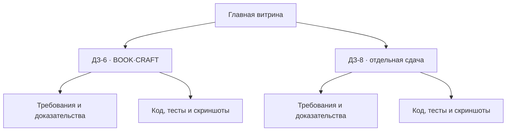

# Vibe Coding — учебные проекты

> Единая витрина практических работ: отдельная сдача каждого задания, проверяемые требования, воспроизводимый запуск и доказательства результата.

## BOOK·CRAFT

Работающий локальный AI-редактор сценариев: выбор жанра, три части произведения, Model Gateway, база знаний, персонажи и контролируемая генерация.

## Навигация по сдачам

| Работа | Продукт | Состояние | Демонстрация | Материалы |
|---|---|---:|---|---|
| [ДЗ-6](submissions/DZ-06/README.md) | BOOK·CRAFT — генератор сценариев | ✅ Код и тесты готовы | [GitHub Pages](https://victorkvs.github.io/Vibe-coding/) | [Исходники](DZ_6_WeWeb_Lovable) |
| [ДЗ-8](submissions/DZ-08/README.md) | Будет указано по исходному заданию | ⏳ Подготовка | — | [Карточка сдачи](submissions/DZ-08/README.md) |

## Принцип организации

Каждая сдача отделяет обязательные требования преподавателя от дополнительных продуктовых функций. Большие видео, модели, локальные базы, ключи и сборочные каталоги в Git не добавляются.

## Подтверждённые результаты ДЗ-6

| Проверка | Результат |
|---|---:|
| Контракт сущностей | 3/3 PASS |
| MIN/MED/MAX | 4/4 PASS |
| Интерактивный UI и восстановление | 3/3 PASS |
| Production build | PASS |
| Уязвимости npm audit | 0 |

Подробности, команды запуска и сценарий записи находятся в [карточке ДЗ-6](submissions/DZ-06/README.md).
