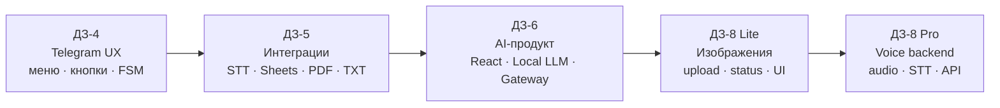
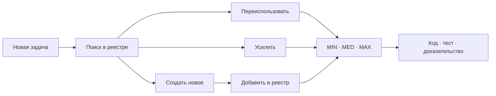
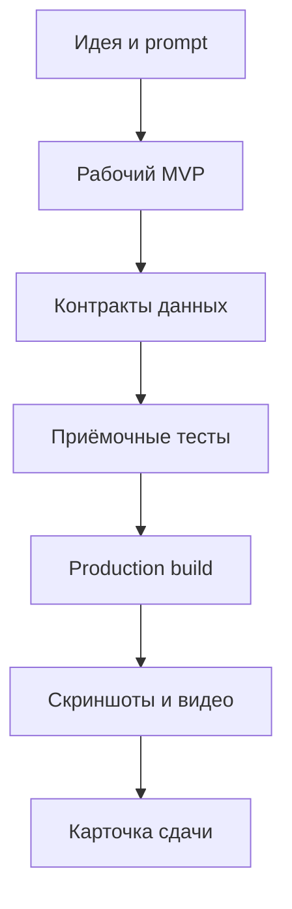

<h1 align="center">⚡ VIBE CODING · AI PRODUCT JOURNEY</h1>

<p align="center">
  <strong>От Telegram-бота с кнопками — к интеграциям, локальным LLM и мультимодальной AI-студии</strong>
</p>

<p align="center">
  <a href="submissions/DZ-04/README.md"></a>
  <a href="submissions/DZ-05/README.md"></a>
  <a href="submissions/DZ-06/README.md"></a>
  <a href="submissions/DZ-08/LITE/README.md"></a>
  <a href="submissions/DZ-08/PRO/README.md"></a>
</p>

> Репозиторий показывает не набор разрозненных домашних работ, а последовательное развитие одного подхода: **интерфейс → интеграции → AI-продукт → мультимодальность → управляемый backend**.

## ✧ BOOKCRAFT ONE — универсальный бот и CRM

**Одно ядро для продаж, клиники, спорткомплекса, автосервиса, массажа и склада.** Сценарии диалога, заявки, история клиента, дашборд и виртуальный секретарь Алина.

[](https://VictorKVS.github.io/Vibe-coding/dz9/)

**[Открыть демо](https://VictorKVS.github.io/Vibe-coding/dz9/) · [ДЗ-9 и проверка PRO](submissions/DZ-09/README.md) · [Код и запуск](DZ_9_BOOKCRAFT_ONE/README.md)**

MVP работает на демонстрационных данных и локальном движке сценариев. Реальные каналы, распознавание и LLM — следующий этап. В каждом профиле есть три учебных обращения и история сохранённых разборов.

## 🎙️ Новое: BOOK·CRAFT Recorder

**Голос → редактируемая аудиозапись → русский текст.** Полноэкранный диктофон, импорт MP3 и локальное распознавание Whisper с реальным прогрессом.

[](submissions/DZ-08/PRO/demo/bookcraft-recorder-demo.mp4)

**[▶ Видео демонстрации](submissions/DZ-08/PRO/demo/bookcraft-recorder-demo.mp4) · [Карточка ДЗ-8 PRO](submissions/DZ-08/PRO/README.md) · [Запуск и исходники](DZ_8_BOOKCRAFT_Media/README.md)**

| Запись и монтаж | Распознавание | Подтверждение |
|---|---|---|
| Микрофон, пауза, продолжение, волна, Undo/Redo | Whisper локально, сегменты по 30 секунд, отмена и продолжение | 8 скриншотов, видео, тесты интерфейса и backend |

На демонстрационных снимках: диктовка **6 секунд → текст за 9 секунд**, MP3 **35 секунд → 2 фрагмента → 100% за 40 секунд**. Это результаты конкретных проверок на авторском компьютере.

## 🧭 Карта развития



| Ступень | Что появилось | Архитектурное развитие |
|---|---|---|
| **ДЗ-4** | Telegram-бот туристического агента | от Notebook к модулям, меню и FSM |
| **ДЗ-5** | AI-секретарь встреч | внешние API, файлы, таблицы и два формата результата |
| **ДЗ-6** | BOOK·CRAFT | полноценный React UI, локальная модель, состояние и тесты |
| **ДЗ-8 Lite** | работа с изображениями | мультимодальный ввод и честная обратная связь интерфейса |
| **ДЗ-8 Pro** | голосовой backend | следующий слой: audio → STT → структурированный ответ |

> ДЗ-7 в текущем составе репозитория не найдено и сознательно не обозначается как выполненное.

## 🧠 База проверенных решений

Репозиторий теперь хранит не только домашние задания, но и повторно используемую
инженерную память. Перед созданием новой функции можно проверить, где похожая
задача уже решалась, насколько решение зрелое и что требуется для его переноса.

| Раздел | Что внутри |
|---|---|
| [Каталог технологий](docs/TECHNOLOGY_REGISTRY.md) | 28 решений и приёмов: источник, зрелость, доказательства, ограничения и улучшения |
| [Реестр для агентов](registry/technologies.json) | структурированные карточки компонентов для автоматического поиска и переиспользования |
| [Автоматическая проверка](registry/verify_registry.py) | уникальность ID, допустимые статусы, наличие исходников и базовый контроль секретов |




## 🚀 Проекты

<table>
<tr>
<td width="50%" valign="top">

### 🧭 ДЗ-4 · AI Travel Premium

Telegram-бот с меню, inline-кнопками, диалоговыми состояниями, каталогом туров, изображениями и LLM-слоем.

**Рост:** Notebook → модульное приложение.

[Открыть карточку](submissions/DZ-04/README.md) · [Исходники](DZ_4_Menus_buttons_dialog_scripts/)

</td>
<td width="50%" valign="top">

### 🎙️ ДЗ-5 · AI-секретарь встреч

Принимает запись созвона, распознаёт речь, формирует AI-анализ и отдаёт PDF-протокол вместе с TXT-транскриптом.

**Рост:** интерфейс → внешние сервисы и артефакты.

[Открыть карточку](submissions/DZ-05/README.md) · [Исходники](DZ_5_Integrations_files,_Sheets,_external_APIs/)

</td>
</tr>
<tr>
<td width="50%" valign="top">

### ✨ ДЗ-6 · BOOK·CRAFT

AI-студия сценариев книг и видеороликов: жанры, локальный GigaChat, Model Gateway, карта мира, персонажи, редакторы и экспорт.

**Рост:** бот → самостоятельный AI-продукт.

[Открыть карточку](submissions/DZ-06/README.md) · [Смотреть видео](submissions/DZ-06/demo/DZ6_BOOKCRAFT_Viktor_Kulichenko.mp4) · [Открыть приложение](https://victorkvs.github.io/Vibe-coding/)

</td>
<td width="50%" valign="top">

### 🖼️ ДЗ-8 · Media & Voice

Lite фиксирует загрузку изображения. В Pro добавлены полноэкранный диктофон, локальное распознавание речи, скриншоты и видеодемонстрация.

**Рост:** текстовый продукт → мультимодальная платформа.

[Обзор ДЗ-8](submissions/DZ-08/README.md) · [Lite](submissions/DZ-08/LITE/README.md) · [Pro](submissions/DZ-08/PRO/README.md)

</td>
</tr>
</table>

## 🏆 Флагман: BOOK·CRAFT

<p align="center">
  <a href="submissions/DZ-06/demo/DZ6_BOOKCRAFT_Viktor_Kulichenko.mp4">
    
  </a>
</p>

<p align="center">
  <a href="submissions/DZ-06/demo/DZ6_BOOKCRAFT_Viktor_Kulichenko.mp4">
    
  </a>
</p>

| Возможность | Реализация |
|---|---|
| AI-генерация | локальный GigaChat3-10B и внешний Model Gateway |
| Управление сюжетом | вступление, развитие и финал |
| Память мира | герои, события, карта и паспорта персонажей |
| Два формата | сценарий книги и сценарий видеоролика |
| Работа с данными | база знаний, импорт и экспорт |
| Надёжность | автосохранение, MIN/MED/MAX, UI и recovery-проверки |

## 🧪 Инженерная зрелость



| Практика | Где подтверждается |
|---|---|
| воспроизводимый запуск | README и стартовые сценарии проектов |
| формальные критерии | MIN / MED / MAX и UI-проверки |
| визуальные доказательства | `submissions/*/screenshots` |
| демонстрация | видео ДЗ-6, видео диктофона ДЗ-8 и последовательность ДЗ-5 |
| секреты вне Git | `.gitignore`, переменные окружения и Colab Secrets |
| разделение продукта и сдачи | исходники в `DZ_*`, карточки в `submissions/` |

## 📁 Навигация по репозиторию

```text
Vibe-coding/
├── DZ_4_Menus_buttons_dialog_scripts/          # AI Travel Premium
├── DZ_5_Integrations_files,_Sheets,_external_APIs/ # AI-секретарь
├── DZ_6_WeWeb_Lovable/                         # BOOK·CRAFT
├── submissions/                                # чистые карточки сдачи
│   ├── DZ-04/
│   ├── DZ-05/
│   ├── DZ-06/
│   └── DZ-08/
├── assets/                                     # медиа туристического агента
└── DZ/                                         # архив исходных учебных материалов
```

- [Открыть единый каталог сдач](submissions/README.md)
- [Открыть ДЗ-4](submissions/DZ-04/README.md)
- [Открыть ДЗ-5](submissions/DZ-05/README.md)
- [Открыть ДЗ-6](submissions/DZ-06/README.md)
- [Открыть ДЗ-8](submissions/DZ-08/README.md)

## 🔐 Правила репозитория

- реальные API-токены, ключи и service-account JSON не публикуются;
- `node_modules`, `dist`, логи и runtime-файлы исключаются;
- пользовательские транскрипты и приватные записи не входят в учебную витрину;
- большие модели хранятся локально, в Git фиксируется только способ подключения;
- статусы «готово» выставляются только при наличии кода и доказательств.

---

<p align="center">
  <strong>Vibe Coding здесь — это путь от идеи к проверяемому AI-продукту.</strong>
</p>
