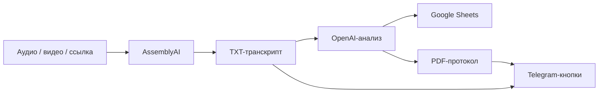
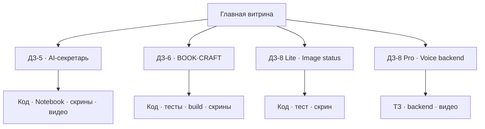

# Vibe Coding · портфолио учебных AI-проектов

> Практические интеграции, воспроизводимый запуск, тестируемые критерии и отдельная карточка сдачи для каждой работы.

[](submissions/DZ-05/README.md)
[](submissions/DZ-06/README.md)
[](submissions/DZ-08/LITE/README.md)
[](submissions/DZ-08/PRO/README.md)

## Проекты

| Работа | Продукт | Ключевой результат | Карточка сдачи |
|---|---|---|---|
| ДЗ‑5 | AI‑секретарь встреч | файлы → STT → Sheets → PDF + TXT | [Открыть](submissions/DZ-05/README.md) |
| ДЗ‑6 | BOOK·CRAFT | AI‑редактор сценариев с жанрами и Model Gateway | [Открыть](submissions/DZ-06/README.md) |
| ДЗ‑8 Lite | BOOK·CRAFT Media | зелёный статус после загрузки изображения | [Открыть](submissions/DZ-08/LITE/README.md) |
| ДЗ‑8 Pro | Voice Backend | audio → STT → user_message | [Открыть](submissions/DZ-08/PRO/README.md) |

## ДЗ‑5 · AI-секретарь встреч



В одном сообщении пользователь получает:

- **«Скачать протокол (PDF)»**;
- **«Скачать транскрипт (TXT)»**.

[Открыть исходники ДЗ‑5](DZ_5_Integrations_files,_Sheets,_external_APIs/) ·
[Открыть Notebook](DZ_5_Integrations_files,_Sheets,_external_APIs/notebooks/DZ5_AI_Secretary_TXT_Download.ipynb) ·
[Открыть в Colab](https://colab.research.google.com/github/VictorKVS/Vibe-coding/blob/agent/dz6-dz8-showcase-clean/DZ_5_Integrations_files,_Sheets,_external_APIs/notebooks/DZ5_AI_Secretary_TXT_Download.ipynb)

## ДЗ‑6 · BOOK·CRAFT

[](submissions/DZ-06/README.md)

Локальный AI‑редактор сценариев: пять жанров, три редактируемые части, база знаний, паспорта персонажей, импорт/экспорт, автосохранение и подключение моделей.

| Проверка | Результат |
|---|---:|
| Контракт сущностей | 3/3 PASS |
| MIN/MED/MAX | 4/4 PASS |
| React UI и восстановление | PASS |
| Production build | PASS |
| npm audit | 0 уязвимостей |

## Организация репозитория

```text
Vibe-coding/
├── DZ_5_Integrations_files,_Sheets,_external_APIs/
├── DZ_6_WeWeb_Lovable/
└── submissions/
    ├── DZ-05/
    ├── DZ-06/
    └── DZ-08/
        ├── LITE/
        └── PRO/
```



Каждая карточка отделяет обязательные требования преподавателя от дополнительных продуктовых функций. В репозиторий не добавляются реальные токены, пользовательские транскрипты, runtime-файлы, модели, `node_modules` и production-сборки.
