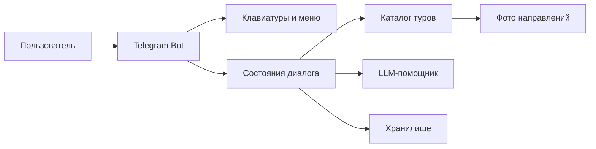
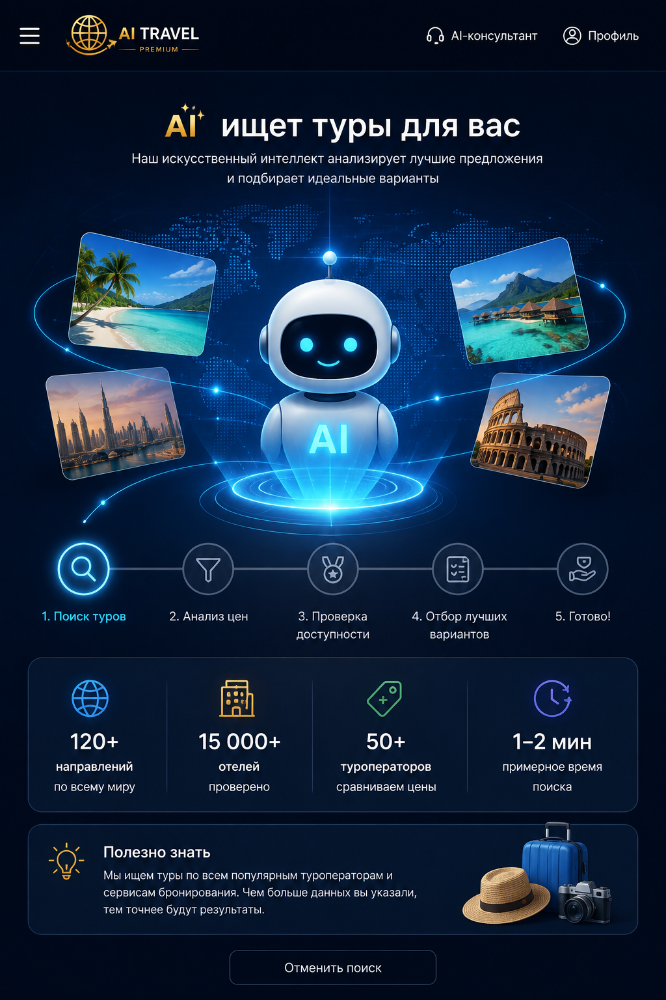
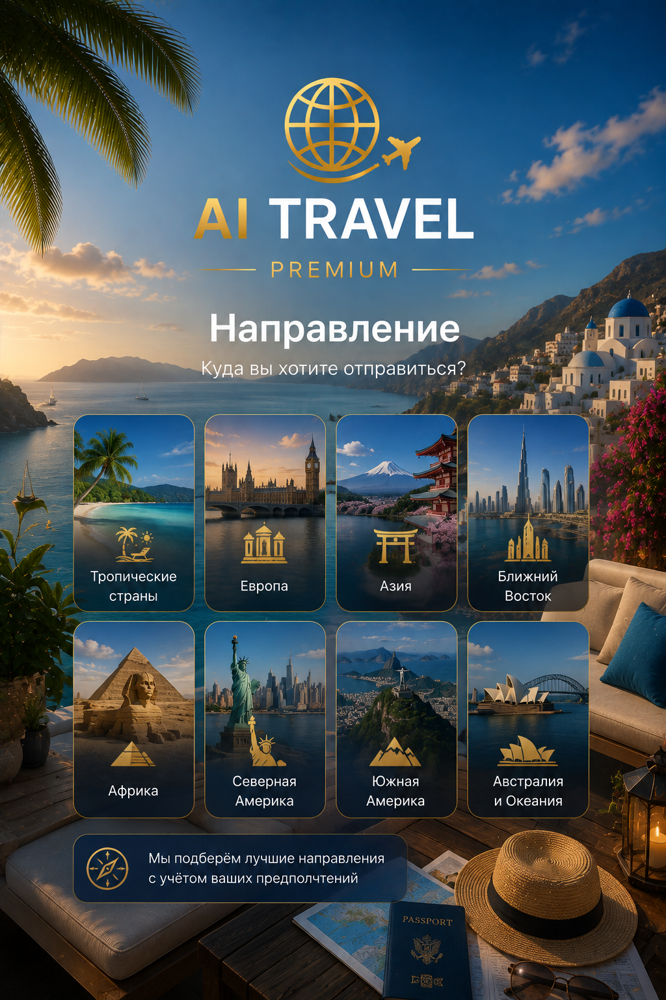
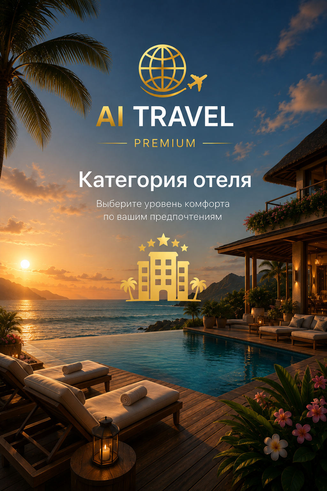
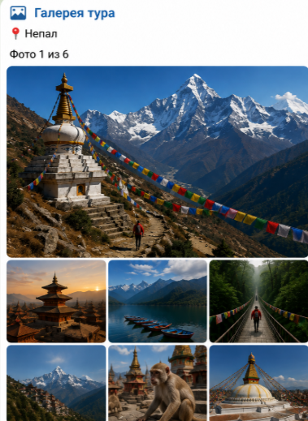

# 🧭 ДЗ-4 — AI Travel Premium

  <strong>Telegram-бот туристического агента: меню, кнопки и диалоговые сценарии</strong>

  
  
  

> Первый продуктовый этап курса: от Notebook к структурированному Telegram-приложению с каталогом направлений, клавиатурами, состояниями диалога, хранилищем и LLM-слоем.

## 🔗 Материалы

- [Исходный код](../../DZ_4_Menus_buttons_dialog_scripts/src/)
- [Notebook AI Travel Premium](../../DZ_4_Menus_buttons_dialog_scripts/AI_TRAVEL_PREMIUM.ipynb)
- [Каталог изображений](../../assets/)
- [Зависимости](../../DZ_4_Menus_buttons_dialog_scripts/requirements.txt)

## 🧩 Архитектура

## ✅ Что реализовано в кодовой базе

| Слой | Реализация |
|---|---|
| Telegram | `bot.py`, `main.py` |
| Меню и inline-кнопки | `keyboards.py` |
| Диалоговые сценарии | `fsm.py` |
| Каталог туров | `catalog.py`, `destinations.py` |
| LLM | `llm.py` |
| База знаний | `knowledge.py`, каталог `knowledge/` |
| Хранение | `storage.py` |
| Медиа | `assets/gallery`, `assets/tours`, `assets/screens` |

## 📸 Визуальные материалы

<table>
<tr>
<td width="50%">

</td>
<td width="50%">

</td>
</tr>
<tr>
<td width="50%">

</td>
<td width="50%">

</td>
</tr>
</table>

## 📈 Полученный навык

**Вход:** отдельный Notebook и набор материалов.  
**Результат:** разнесённое по модулям Telegram-приложение с управляемым пользовательским сценарием.

Это фундамент следующего этапа — подключения файлов, таблиц и внешних API в ДЗ-5.
