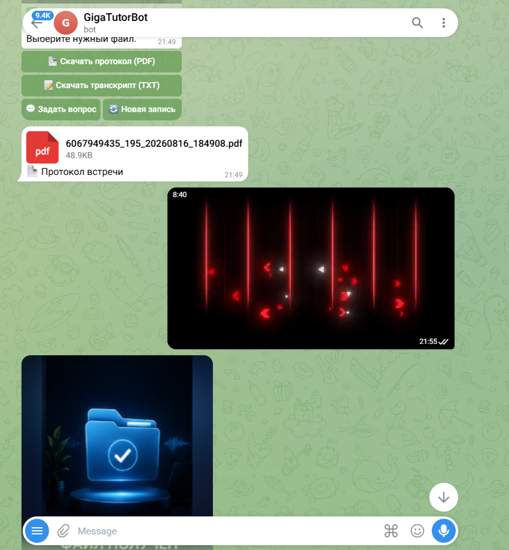
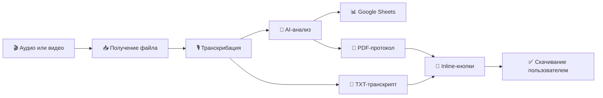
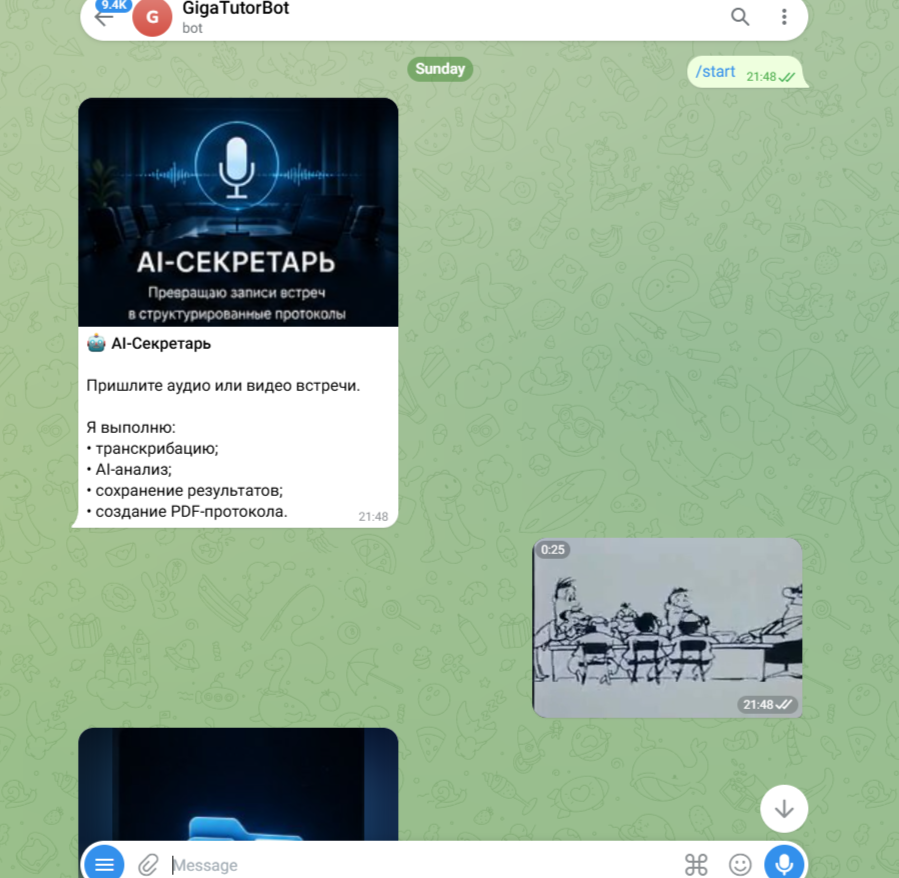
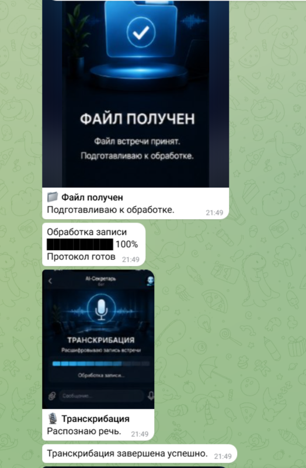
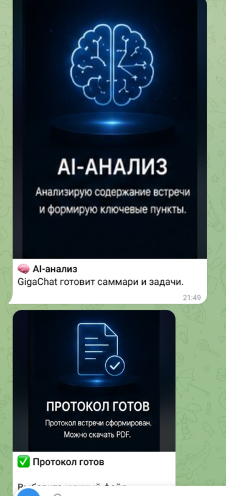
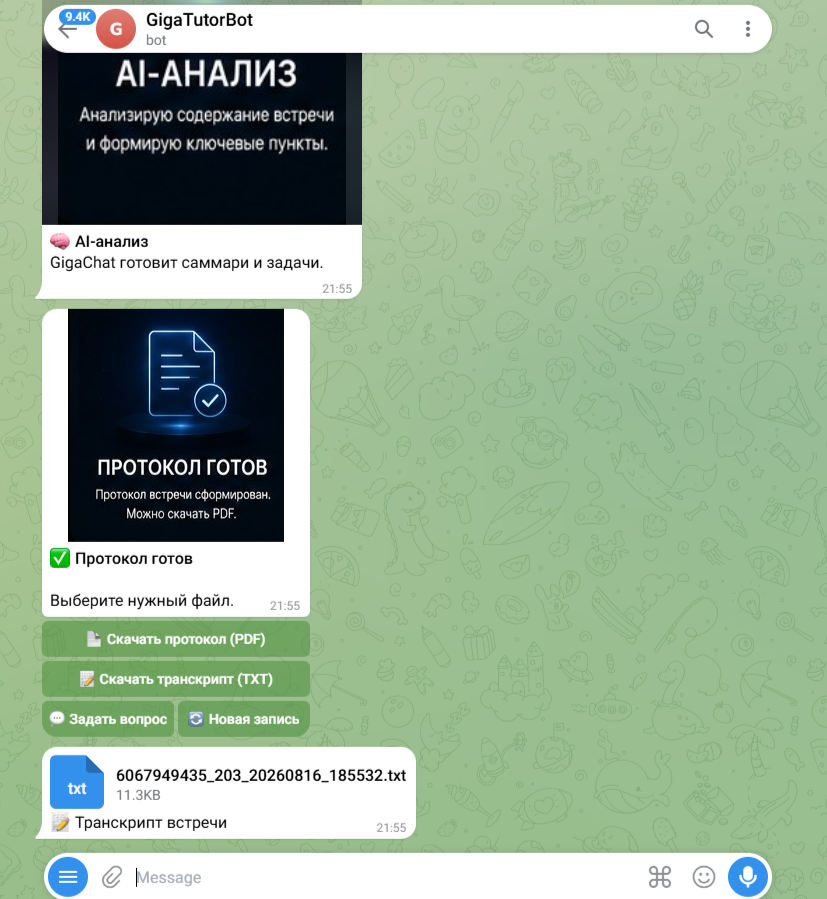
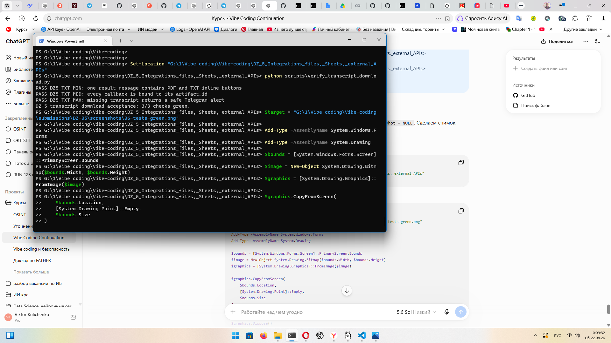

# 🎙️ ДЗ-5 — AI-секретарь встреч

<p align="center">
  <strong>Интеграции: файлы · Google Sheets · внешние API · Telegram</strong>
</p>

<p align="center">
  
  
  
  
</p>

> Telegram-бот принимает аудио или видео встречи, распознаёт речь, выполняет AI-анализ и возвращает **PDF-протокол** и **полный TXT-транскрипт** через две inline-кнопки в одном сообщении.

<p align="center">
  
</p>

## ✅ Результат

| Требование | Реализация | Статус |
|---|---|:---:|
| Кнопка «Скачать протокол (PDF)» | PDF отправляется пользователю из результата конкретного созвона | ✅ |
| Кнопка «Скачать транскрипт (TXT)» | TXT отправляется отдельным файлом в UTF-8 | ✅ |
| Обе кнопки в одном сообщении | Единая inline-клавиатура результата | ✅ |
| Файл относится к нужному созвону | callback привязан к уникальному `artifact_id` | ✅ |
| Транскрипт отсутствует | Понятный Telegram alert без падения бота | ✅ |
| Автоматическая проверка | MIN / MED / MAX — **3/3 green** | ✅ |
| Скриншоты работы | Шесть подтверждающих изображений в репозитории | ✅ |
| Публичная копия Notebook | [Открыть на Google Диске](https://drive.google.com/file/d/122yMR8T8XbuLaFdxbqOk_lvfeljDOhR9/view?usp=drivesdk) | ✅ |

## 🔗 Быстрые ссылки

- [Исходный код проекта](../../DZ_5_Integrations_files,_Sheets,_external_APIs/)
- [Jupyter Notebook в репозитории](../../DZ_5_Integrations_files,_Sheets,_external_APIs/notebooks/DZ5_AI_Secretary_TXT_Download.ipynb)
- [Публичный Notebook на Google Диске](https://drive.google.com/file/d/122yMR8T8XbuLaFdxbqOk_lvfeljDOhR9/view?usp=drivesdk)
- [Открыть Notebook в Google Colab](https://colab.research.google.com/github/VictorKVS/Vibe-coding/blob/agent/dz6-dz8-showcase-clean/DZ_5_Integrations_files,_Sheets,_external_APIs/notebooks/DZ5_AI_Secretary_TXT_Download.ipynb)
- [Архитектура решения](../../DZ_5_Integrations_files,_Sheets,_external_APIs/docs/ARCHITECTURE.md)
- [Все скриншоты](screenshots/)
- [Чек-лист записи демонстрации](demo/RECORDING_CHECKLIST.md)

## 🧭 Как работает бот



## 📸 Демонстрация по шагам

<table>
<tr>
<td width="50%" valign="top">

### 1. Запуск и загрузка

Пользователь запускает AI-секретаря и отправляет аудио или видео встречи.



</td>
<td width="50%" valign="top">

### 2. Транскрибация

Бот принимает файл, показывает прогресс и распознаёт речь.



</td>
</tr>
<tr>
<td width="50%" valign="top">

### 3. AI-анализ

После распознавания модель формирует саммари, задачи и протокол встречи.



</td>
<td width="50%" valign="top">

### 4. PDF-протокол

В одном сообщении доступны обе кнопки; PDF успешно отправляется пользователю.


</td>
</tr>
<tr>
<td width="50%" valign="top">

### 5. TXT-транскрипт

Вторая кнопка отправляет полный текст последнего обработанного созвона.



</td>
<td width="50%" valign="top">

### 6. Автоматическая приёмка

Проверены интерфейс, привязка к артефакту и безопасная обработка отсутствующего файла.



</td>
</tr>
</table>

## 🧪 Приёмочные уровни

| Уровень | Что проверяется | Результат |
|---|---|:---:|
| **MIN** | PDF и TXT отображаются одновременно | ✅ PASS |
| **MED** | Каждый callback содержит `artifact_id` нужного созвона | ✅ PASS |
| **MAX** | Отсутствующий TXT вызывает alert, бот продолжает работу | ✅ PASS |

Запуск проверки:

```powershell
Set-Location "DZ_5_Integrations_files,_Sheets,_external_APIs"
python scripts/verify_transcript_download.py
```

Ожидаемый итог:

```text
PASS DZ5-TXT-MIN: one result message contains PDF and TXT inline buttons
PASS DZ5-TXT-MED: every callback is bound to its artifact_id
PASS DZ5-TXT-MAX: missing transcript returns a safe Telegram alert
DZ-5 transcript download acceptance: 3/3 checks green.
```

## 🧩 Использованные интеграции

| Компонент | Назначение |
|---|---|
| Telegram Bot / aiogram | приём записи, статусы и inline-кнопки |
| AssemblyAI | распознавание речи |
| LLM API | саммари, решения, задачи и ответственные |
| Google Sheets API | сохранение структурированных результатов |
| ReportLab | формирование PDF-протокола |
| TXT UTF-8 | полный текст транскрипта |

## 🔐 Безопасность

- API-ключи не сохраняются в Notebook и Git;
- секреты задаются через переменные окружения или Colab Secrets;
- callback не содержит секретных данных;
- временные записи и результаты исключены через `.gitignore`;
- Notebook перед публикацией не должен содержать токены и приватные outputs.

## 📮 Ссылка для сдачи

<p align="center">
  <a href="https://drive.google.com/file/d/122yMR8T8XbuLaFdxbqOk_lvfeljDOhR9/view?usp=drivesdk"><strong>📓 Открыть публичный Jupyter Notebook на Google Диске</strong></a>
</p>
