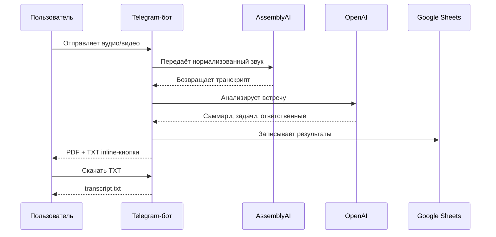

# ДЗ-5 — Интеграции: файлы, Sheets, внешние API

## Результат

Telegram-бот **AI-секретарь встреч** принимает запись созвона и формирует два скачиваемых результата в одном сообщении:

| Артефакт | Кнопка | Формат |
|---|---|---:|
| Протокол встречи | «Скачать протокол (PDF)» | PDF |
| Полный транскрипт | «Скачать транскрипт (TXT)» | UTF-8 TXT |

- [Исходники проекта](../../DZ_5_Integrations_files,_Sheets,_external_APIs/)
- [Jupyter Notebook](../../DZ_5_Integrations_files,_Sheets,_external_APIs/notebooks/DZ5_AI_Secretary_TXT_Download.ipynb)
- [Открыть Notebook в Colab](https://colab.research.google.com/github/VictorKVS/Vibe-coding/blob/agent/dz6-dz8-showcase-clean/DZ_5_Integrations_files,_Sheets,_external_APIs/notebooks/DZ5_AI_Secretary_TXT_Download.ipynb)
- [Архитектура](../../DZ_5_Integrations_files,_Sheets,_external_APIs/docs/ARCHITECTURE.md)

## Статус сдачи

| Компонент | Статус |
|---|:---:|
| TXT inline-кнопка | ✅ |
| PDF inline-кнопка | ✅ |
| Привязка к artifact_id | ✅ |
| Безопасная ошибка отсутствующего файла | ✅ |
| Автоматическая приёмка | ✅ код готов |
| Публичная копия Notebook на Диске | ⏳ |
| Скриншоты | ⏳ |
| Демонстрационное видео | ⏳ |

## Пользовательский сценарий



## Приёмочные уровни

| Уровень | Проверка | Критерий |
|---|---|---|
| MIN | Две кнопки в одном сообщении | PDF и TXT видны одновременно |
| MED | Правильный файл | callback содержит artifact_id созвона |
| MAX | Отказоустойчивость | отсутствующий TXT вызывает alert, бот продолжает работу |

## Команда проверки

```powershell
Set-Location "DZ_5_Integrations_files,_Sheets,_external_APIs"
python scripts/verify_transcript_download.py
```

## Доказательства

| Файл | Что показать |
|---|---|
| `01-two-buttons.png` | одно сообщение с PDF и TXT |
| `02-pdf-downloaded.png` | полученный PDF |
| `03-transcript-downloaded.png` | полученный TXT |
| `04-missing-transcript-alert.png` | безопасная ошибка |
| `05-tests-green.png` | приёмка 3/3 |
| `DZ5_AI_Secretary_demo.mp4` | полный короткий сценарий |

Правила подготовки: [screenshots/README.md](screenshots/README.md) и [demo/RECORDING_CHECKLIST.md](demo/RECORDING_CHECKLIST.md).

## Ссылки для преподавателя

- **Публичный Jupyter Notebook:** ⏳ вставить ссылку Google/Яндекс Диска.
- **Скриншоты:** ⏳ вставить открытую ссылку.
- **Короткое видео:** ⏳ вставить открытую ссылку.

Перед сдачей каждую ссылку проверить в приватном окне браузера.
