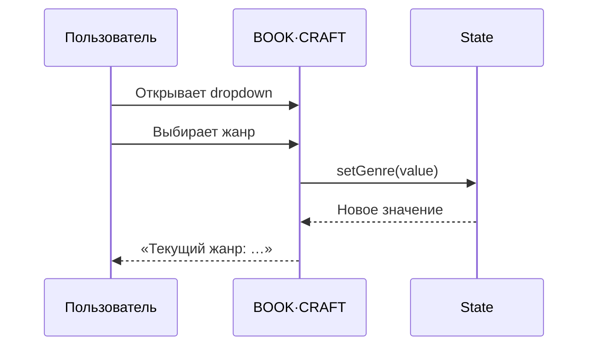

# ДЗ-6 — BOOK·CRAFT

## Результат

Веб-приложение для работы со сценариями книг и видеороликов. Формальное задание закрыто управляемым dropdown из пяти жанров, хранением выбранного значения в состоянии формы и немедленным отображением текущего жанра.

- [Открыть исходники приложения](../../DZ_6_WeWeb_Lovable)
- [Открыть публичную витрину](https://victorkvs.github.io/Vibe-coding/)
- [Открыть сценарий записи](../../DZ_6_WeWeb_Lovable/DEMO_RUNBOOK.md)

## Визуальный результат

[](screenshots/01-start-screen.png)

| Dropdown и пять жанров | Текущий жанр и выбор модели |
|---|---|
| [](screenshots/02-genre-dropdown.png) | [](screenshots/03-current-genre-and-model.png) |

[](screenshots/04-script-editors.png)

Скриншоты подтверждают стартовый экран, два режима сценария, пять значений dropdown, видимый текущий жанр, локальную модель и три редактируемые части произведения.

## Матрица требований

| № | Требование | Реализация | Доказательство | Статус |
|---:|---|---|---|:---:|
| 1 | Dropdown «Выберите жанр» | Управляемый React `select` | UI-тест и скриншот 02 | ✅ |
| 2 | Не менее пяти жанров | Фантастика, Детектив, Роман, Комедия, Триллер | Контракт `GENRES` | ✅ |
| 3 | Сохранение выбранного жанра | React state и автосохранение проекта | MIN и recovery-тесты | ✅ |
| 4 | Видимое обновление значения | Строка «Текущий жанр» | Интерактивный MIN-UI и скриншот 03 | ✅ |
| 5 | Доступность для backend | Жанр входит в состояние и запрос модели | Исходный код | ✅ |
| 6 | Запись экрана | Сценарий подготовлен | Ссылка добавляется после записи | ⏳ |

## Как работает обязательный сценарий



## Проверки

```powershell
Set-Location "DZ_6_WeWeb_Lovable"
npm install
npm test
npm run build
```

Подтверждённый результат:

| Уровень | Что проверяется | Результат |
|---|---|---:|
| MIN | Dropdown, пять значений, видимый state | PASS |
| MED | Локальная генерация и ручное редактирование | PASS |
| MAX | Граница синтетического демомира | PASS |
| UI | Реальный React-компонент и смена жанра | PASS |
| Recovery | Автосохранение без API-ключей | PASS |

## Скриншоты для сдачи

| Файл | Что должно быть видно |
|---|---|
| `01-start-screen.png` | Стартовый экран и выбор сценария книги |
| `02-genre-dropdown.png` | Раскрытый список из пяти жанров |
| `03-current-genre.png` | Выбранный «Триллер» и строка текущего жанра |
| `04-editors.png` | Вступление, развитие и финал |
| `05-tests-green.png` | Полный зелёный вывод `npm test` |
| `06-build-green.png` | Успешный `npm run build` |

Места и правила именования: [screenshots/README.md](screenshots/README.md).

## Видео

Рекомендуемое имя:

```text
DZ6_BOOKCRAFT_Viktor_Kulichenko.mp4
```

После загрузки на Google Диск или Яндекс Диск здесь размещается открытая ссылка. Перед отправкой ссылка проверяется в приватном окне браузера.

## Дополнительные возможности

BOOK·CRAFT превосходит минимальное задание: два режима сценария, три редактируемых блока, локальный GigaChat, Model Gateway, база знаний, паспорта персонажей, импорт/экспорт JSON, автосохранение и инженерная карта мира. Эти функции показываются после обязательного блока сдачи.
