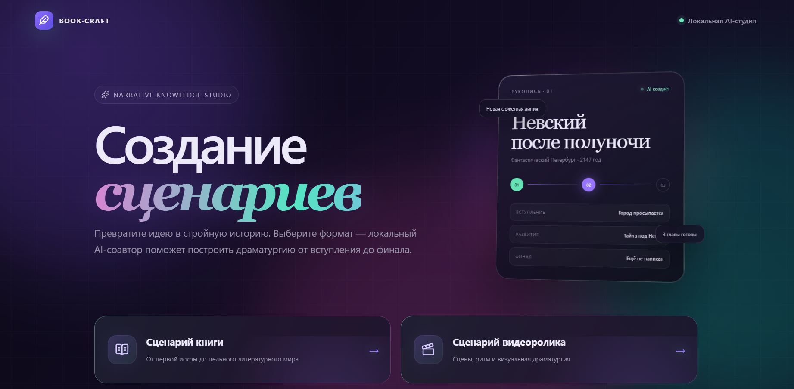
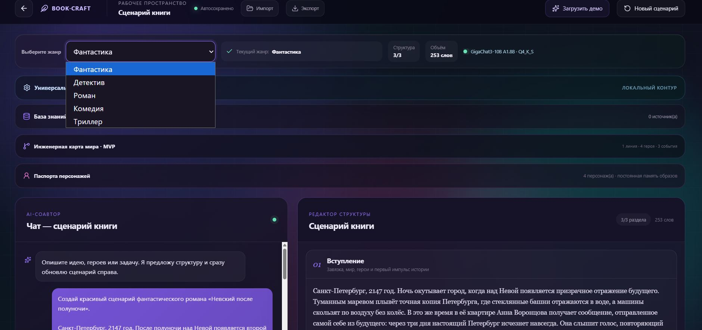
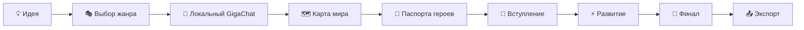
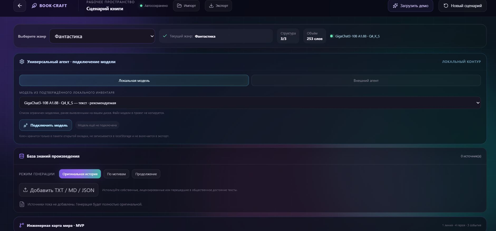
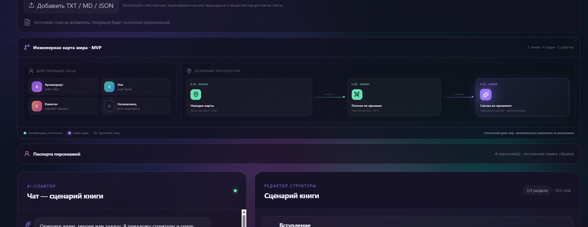
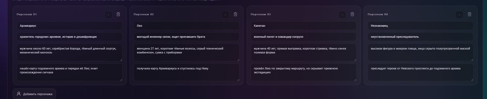
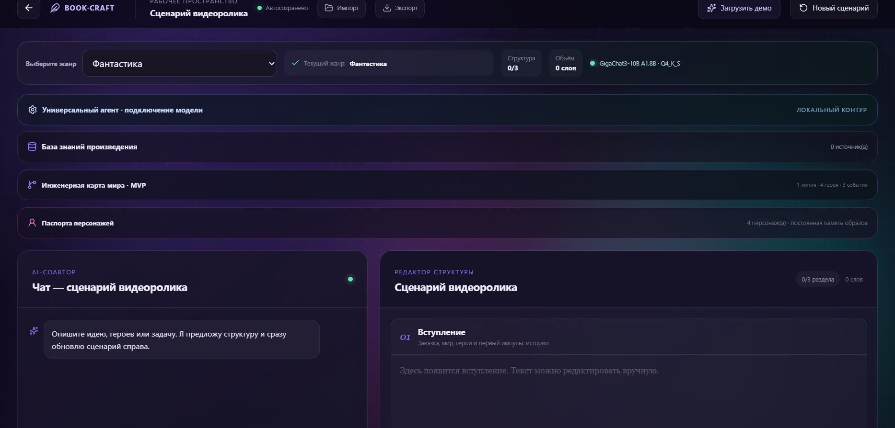
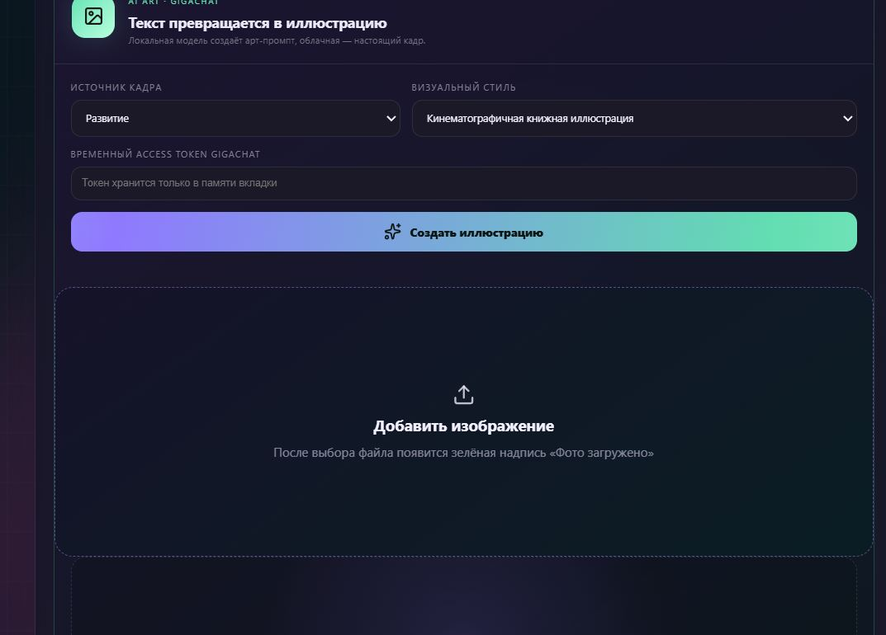

# ✨ ДЗ-6 — BOOK·CRAFT

<p align="center">
  <strong>AI-студия для создания сценариев книг и видеороликов</strong>
</p>

<p align="center">
  
  
  
  
</p>

> BOOK·CRAFT превращает идею в структурированный сценарий: пользователь выбирает жанр, подключает локальную модель, управляет героями и хронологией, редактирует вступление, развитие и финал, а затем экспортирует результат.

<p align="center">
  <a href="screenshots/07-bookcraft-start-screen.jpg">
    
  </a>
</p>

## 🎬 Демонстрационное видео

<p align="center">
  <a href="demo/DZ6_BOOKCRAFT_Viktor_Kulichenko.mp4">
    
  </a>
</p>

<p align="center">
  <a href="demo/DZ6_BOOKCRAFT_Viktor_Kulichenko.mp4">
    
  </a>
</p>

**Файл:** [DZ6_BOOKCRAFT_Viktor_Kulichenko.mp4](demo/DZ6_BOOKCRAFT_Viktor_Kulichenko.mp4) · 37,16 МБ

## 🔗 Быстрые ссылки

- [Исходники приложения](../../DZ_6_WeWeb_Lovable)
- [Публичная витрина](https://victorkvs.github.io/Vibe-coding/)
- [Демонстрационное видео](demo/DZ6_BOOKCRAFT_Viktor_Kulichenko.mp4)
- [Все скриншоты](screenshots/)
- [Сценарий демонстрации](../../DZ_6_WeWeb_Lovable/DEMO_RUNBOOK.md)

## ✅ Матрица требований

| № | Требование | Реализация | Доказательство | Статус |
|---:|---|---|---|:---:|
| 1 | Dropdown «Выберите жанр» | Управляемый React `select` | Скриншоты 02 и 08 | ✅ |
| 2 | Не менее пяти жанров | Фантастика, Детектив, Роман, Комедия, Триллер | Контракт `GENRES` | ✅ |
| 3 | Сохранение выбранного жанра | React state и автосохранение | MIN и Recovery | ✅ |
| 4 | Видимое обновление жанра | Строка «Текущий жанр» | Скриншоты 03 и 08 | ✅ |
| 5 | Доступность для backend | Жанр передаётся модели вместе с состоянием | Исходный код | ✅ |
| 6 | Запись экрана | Полный сценарий BOOK·CRAFT | Видео 37,16 МБ | ✅ |

## 🧭 Как работает приложение



## 📸 Фотогалерея проекта

<table>
<tr>
<td width="50%" valign="top">

### Стартовая AI-студия

Два рабочих режима: сценарий книги и сценарий видеоролика.

<a href="screenshots/07-bookcraft-start-screen.jpg">

</a>

</td>
<td width="50%" valign="top">

### Фантастика и готовый сценарий

Выбран жанр «Фантастика», структура заполнена полностью — 3/3 раздела.

<a href="screenshots/08-fantasy-genre-and-result.jpg">

</a>

</td>
</tr>
<tr>
<td width="50%" valign="top">

### Локальная модель

Подключение GigaChat3-10B через локальный контур без передачи рукописи во внешний сервис.

<a href="screenshots/09-local-gigachat-model.jpg">

</a>

</td>
<td width="50%" valign="top">

### Инженерная карта мира

Герои и события собраны в наглядную хронологию произведения.

<a href="screenshots/10-world-engineering-map.jpg">

</a>

</td>
</tr>
<tr>
<td width="50%" valign="top">

### Паспорта персонажей

Для каждого героя сохраняются роль, внешность и важные события биографии.

<a href="screenshots/11-character-passports.jpg">

</a>

</td>
<td width="50%" valign="top">

### Сценарий видеоролика

Отдельное рабочее пространство для сцен, ритма и визуальной драматургии.

<a href="screenshots/12-video-script-mode.jpg">

</a>

</td>
</tr>
<tr>
<td colspan="2" valign="top">

### Генератор иллюстраций

Выбранный фрагмент сценария превращается в визуальный промт; также можно добавить собственное изображение.

<a href="screenshots/13-illustration-generator.jpg">

</a>

</td>
</tr>
</table>

## 🧪 Проверки

```powershell
Set-Location "DZ_6_WeWeb_Lovable"
npm install
npm test
npm run build
```

| Уровень | Что проверяется | Результат |
|---|---|:---:|
| Entity | Контракт сущностей и строгая валидация | ✅ 3/3 |
| MIN | Dropdown, пять жанров и видимый state | ✅ PASS |
| MED | Локальная генерация и ручное редактирование | ✅ PASS |
| MAX | Граница синтетического демомира | ✅ PASS |
| UI | React-компонент и смена жанра | ✅ PASS |
| Recovery | Автосохранение без API-ключей | ✅ PASS |
| Build | Production-сборка Vite | ✅ PASS |

## 🚀 Возможности сверх минимального задания

- два режима: книга и видеоролик;
- локальный GigaChat и универсальный Model Gateway;
- три редактируемые части произведения;
- инженерная карта мира и хронология;
- паспорта и постоянная память персонажей;
- база знаний TXT / MD / JSON;
- импорт, экспорт и автосохранение;
- подготовка иллюстраций по выделенному фрагменту.

## 📮 Материалы для сдачи

<p align="center">
  <a href="demo/DZ6_BOOKCRAFT_Viktor_Kulichenko.mp4"><strong>▶️ Смотреть демонстрационное видео</strong></a>
  &nbsp;·&nbsp;
  <a href="screenshots/"><strong>🖼️ Открыть все скриншоты</strong></a>
  &nbsp;·&nbsp;
  <a href="../../DZ_6_WeWeb_Lovable"><strong>💻 Открыть исходный код</strong></a>
</p>
