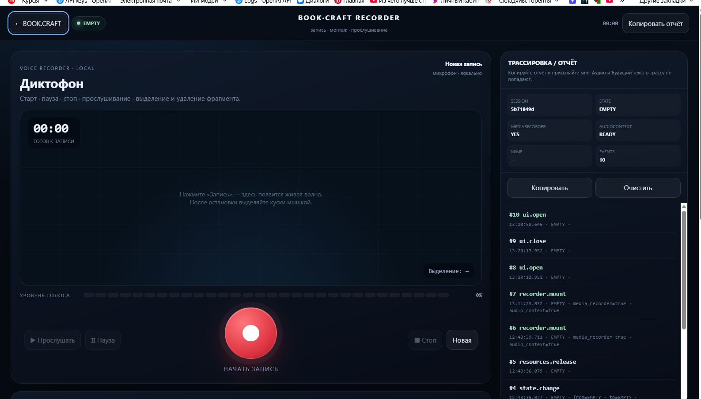
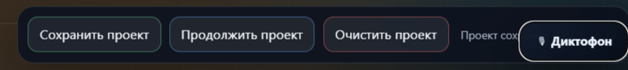
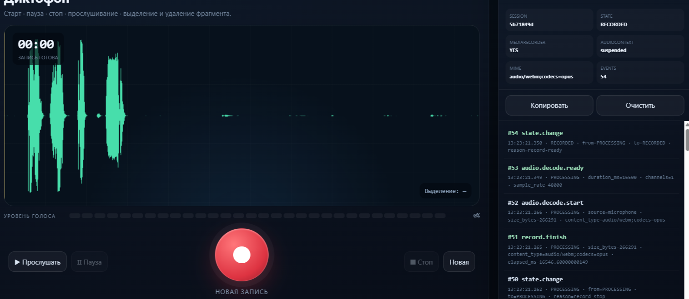
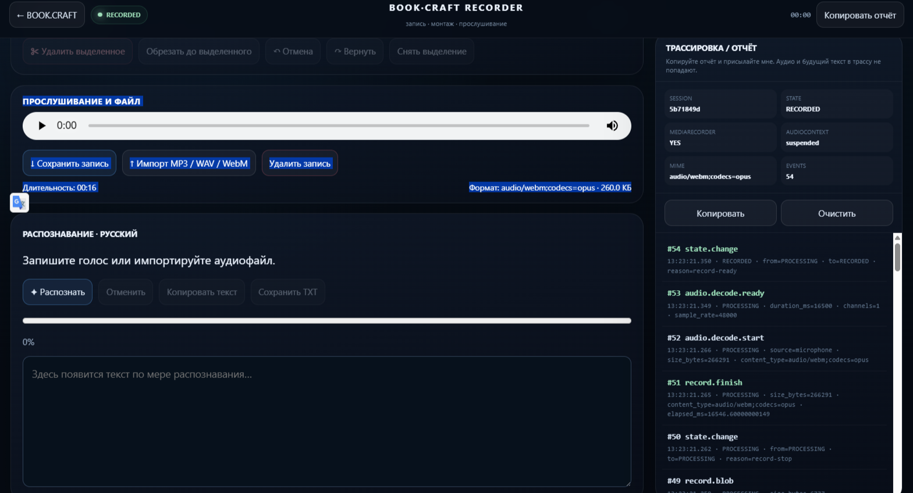
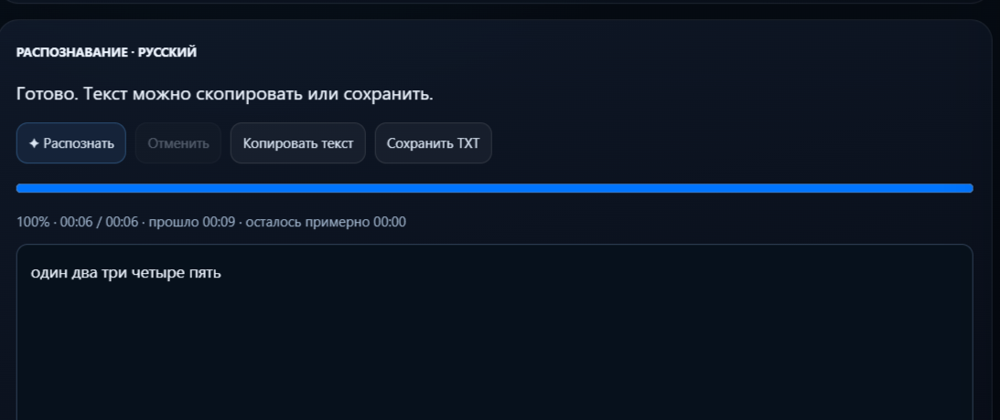
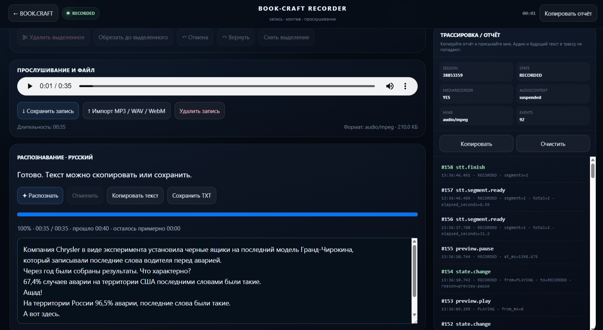
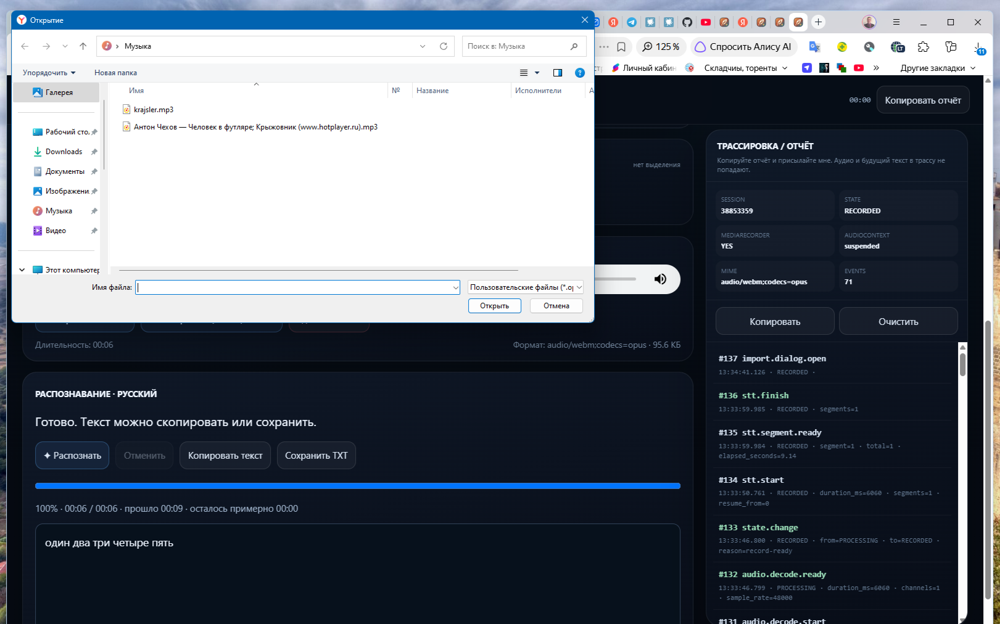

<h1 align="center">🎙️ BOOK·CRAFT · Voice & Recorder</h1>
<p align="center"><strong>ДЗ-8 PRO · запись, монтаж и локальное распознавание речи</strong></p>
<p align="center">React / Vite · Web Audio · FastAPI · whisper.cpp · русский язык</p>

[← Все работы](../../README.md) · [Исходники и запуск](../../../DZ_8_BOOKCRAFT_Media/README.md) · [Технические детали STT](../../../DZ_8_BOOKCRAFT_Media/RECORDER_STT.md)

## Демонстрация

[](demo/bookcraft-recorder-demo.mp4)

**[▶ Открыть запись экрана · MP4](demo/bookcraft-recorder-demo.mp4)** · исходное видео автора, **2:28 · 1280 × 720 · 18.5 МБ**. Если GitHub предлагает скачать файл, откройте его в браузере или локальном проигрывателе.

## 1. Открытие отдельной страницы

Кнопка «Диктофон» открывает полноэкранное рабочее пространство. Справа постоянно доступна панель «Трассировка / отчёт».



## 2. Запись и прослушивание

Микрофон → запись → пауза / продолжение → стоп. После остановки отображается реальная волна AudioBuffer. Запись можно прослушать, сохранить, выделить участок, удалить его или обрезать до выделения; Undo/Redo возвращают изменения.



На снимке журнал фиксирует завершение записи и декодирование: **16.5 секунды, 48 кГц, один канал**. Монтаж AudioBuffer и отмена изменений дополнительно проверяются автоматическими тестами.

<details>
<summary>Прослушивание, сохранение и импорт файла</summary>



</details>

## 3. Диктовка → русский текст

Whisper запускается локально. По мере обработки появляются текст, процент и время; результат можно скопировать или сохранить в TXT.



**Зафиксированный результат:** 6 секунд записи, около 9 секунд обработки, 100%, текст «один два три четыре пять».

## 4. Импорт MP3 → распознавание по сегментам

Файл выбирается с компьютера. Диктофон декодирует его в браузере, подготавливает моно WAV 16 кГц и передаёт локальному сервису фрагментами по 30 секунд.



**Зафиксированный результат:** MP3 длительностью 35 секунд, 2 сегмента, около 40 секунд обработки. Справа видны `stt.segment.ready` и `stt.finish`. Текст в демонстрационном аудио является содержимым тестового файла, а не фактологическим утверждением проекта.

<details>
<summary>Выбор MP3 на компьютере</summary>



</details>

## Надёжность и диагностика

| Ситуация | Поведение |
|---|---|
| Whisper занят | Запрос ожидает очередь; параллельный процесс не запускается |
| Отмена | Запрос и обработка прерываются, готовые фрагменты остаются |
| Повторный запуск | Продолжение с необработанного фрагмента |
| Аудио изменилось | Новое распознавание не получает старые ответы |
| Ошибка импорта | Предыдущая запись сохраняется |
| Отказ микрофона | Понятное сообщение и событие в отчёте |
| Диагностика | Метаданные, этапы и ошибки; без аудиобайтов и текста расшифровки |

Исправление очереди добавлено после первоначальной демонстрации: два одновременных реальных запроса завершились HTTP 200. Тесты также проверяют отмену ожидающего запроса и освобождение процесса.

## Проверки и воспроизведение

Из `DZ_8_BOOKCRAFT_Media`:

```powershell
npm ci
npm test
npm run build
python -m unittest discover -s tests -p test_recorder_stt.py
```

| Область | Проверка |
|---|---|
| Запись / монтаж / восстановление | [verify-recorder-page.mjs](../../../DZ_8_BOOKCRAFT_Media/scripts/verify-recorder-page.mjs) |
| Прогресс / отмена / повтор / приватность текста | [verify-recorder-stt.mjs](../../../DZ_8_BOOKCRAFT_Media/scripts/verify-recorder-stt.mjs) |
| PCM / Whisper / очередь / отключение клиента | [test_recorder_stt.py](../../../DZ_8_BOOKCRAFT_Media/tests/test_recorder_stt.py) |

## Контракт задания PRO

Исходное задание требует: необязательный `audio`, приоритет непустого `user_message`, распознавание при пустом тексте и передачу результата в основной pipeline с прежней историей и профилем.

Этот маршрут реализован отдельно в [backend/app.py](../../../DZ_8_BOOKCRAFT_Media/backend/app.py) и проверяется [test_media_contract.py](../../../DZ_8_BOOKCRAFT_Media/tests/test_media_contract.py). Самостоятельный диктофон использует другой маршрут: [backend/recorder_stt.py](../../../DZ_8_BOOKCRAFT_Media/backend/recorder_stt.py).

**Граница доказательств:** приведённые снимки подтверждают запись и расшифровку. Итоговый ответ LLM после голосового запроса нужно проверять отдельно; он не выводится автоматически из успешного STT.

## Ограничения

- Для работы нужны локальные Python, Whisper и модель; GitHub Pages не запускает Python/STT.
- Длинный файл целиком декодируется в память браузера. Монтаж и экспорт могут занимать время.
- Процент обновляется после готового сегмента; ETA — оценка.
- На границах независимых 30-секундных фрагментов возможны ошибки слов.
- Аудио и текст хранятся в памяти вкладки: сохраните WAV/TXT перед закрытием.

[Все 8 снимков и происхождение файлов](screenshots/README.md) · [Инструкция запуска](../../../DZ_8_BOOKCRAFT_Media/README.md)
