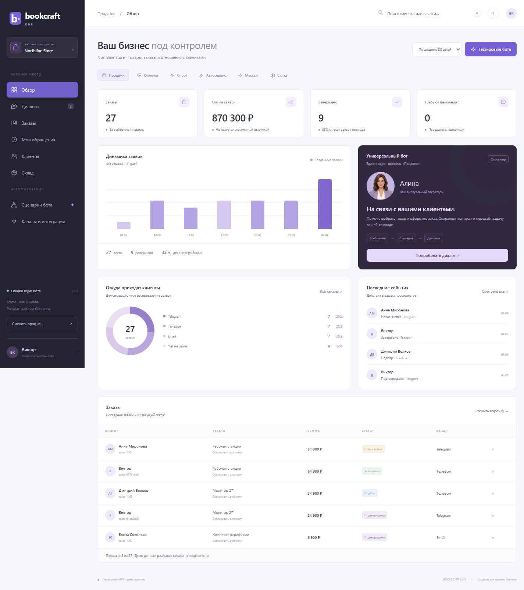
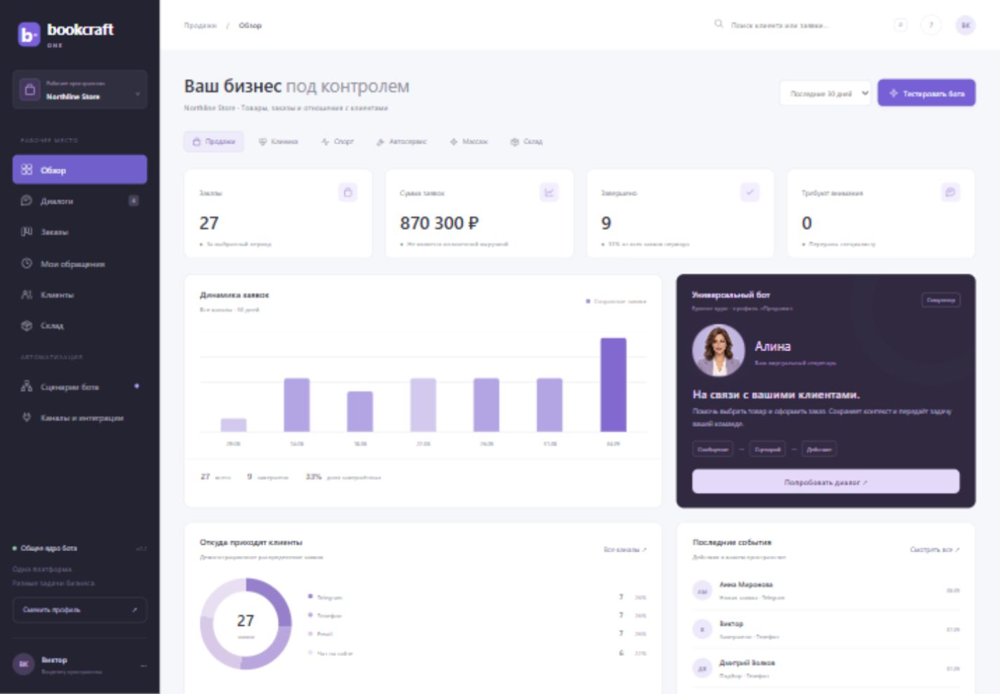
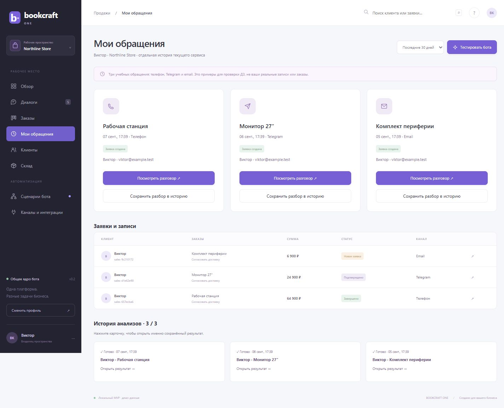

<h1 align="center">BOOKCRAFT ONE</h1>

<strong>Универсальный бот · CRM-контекст · секретарь Алина</strong>

ДЗ-9 · UX для AI-сервисов и обработка ошибок · MVP

**[Открыть интерактивное демо](https://VictorKVS.github.io/Vibe-coding/dz9/) · [Исходники и запуск](../../DZ_9_BOOKCRAFT_ONE/README.md) · [Сценарий проверки](../../DZ_9_BOOKCRAFT_ONE/ACCEPTANCE.md)**

Один сценарный движок адаптируется под продажи, клинику, спорткомплекс, автосервис, массажный салон и склад. Бот уточняет запрос, предлагает позиции из каталога, получает подтверждение и создаёт заявку в CRM. Рядом — история клиента, воронка, дашборд и ответственный.

## Что проверить за две минуты

1. Переключить профиль бизнеса на дашборде или через название пространства слева.
2. Открыть «Мои обращения»: в каждом профиле есть три учебных диалога Виктора и связанные заявки.
3. Открыть по очереди три карточки «Истории анализов». Каждый раз показывается именно сохранённый результат со статусом «Готово».
4. Нажать «Тестировать бота», пройти сценарий до подтверждения и увидеть новую заявку в воронке.
5. Проверить отмену и имитацию ошибки: ввод остаётся доступным для повтора.

## Секретарь и диалог

Вымышленный женский персонаж с улыбкой, морганием и небольшим движением во время речи. Озвучивание использует доступный русский голос браузера. Проверен запуск Microsoft Irina; точного lip-sync нет. Кнопка «Послушать» и флажок «Озвучивать ответы» доступны в тестовой беседе.

## История трёх разборов

| Требование PRO | Реализация в MVP |
|---|---|
| Заголовок, время и текст результата | Отдельные объекты истории |
| Не более трёх результатов | Четвёртый вытесняет старейший |
| Открыть сохранённый результат | Карточка восстанавливает текст, без нового разбора |
| Состояние готового результата | «Результат анализа · Готово» |
| Очистка ввода сохраняет историю | Отдельное хранение формы, диалогов и результатов |

## Проверки и границы

17 тестов ядра и один сквозной тест UI проверяют все профили, подтверждение заявки, остатки, контакты, изоляцию, историю, отмену и восстановление после ошибки. Интерфейс проверен на ширине 1440 и 390 px. Дашборд вычисляет показатели из демо-записей.

Это **MVP интерфейса и сценарного ядра**, а не подключённый многоканальный AI-сервис. LLM, распознавание аудио, реальные звонки, мессенджеры, календарь и серверная база ещё не подключены. Учебные обращения не являются реальными покупками или медицинскими записями.

Для окончательной сдачи исходного задания PRO требуется запись экрана с **тремя разными аудиозвонками** и переключением их результатов, опубликованная на Google или Яндекс Диске. Текущие учебные диалоги демонстрируют поведение интерфейса; такая видеозапись пока не приложена.
