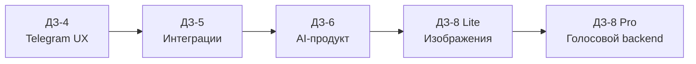

# 📚 Каталог учебных работ Vibe Coding

> Карточки сдачи отделяют требования преподавателя от расширенных продуктовых возможностей и показывают развитие проекта по этапам.

| Этап | Продукт | Главный навык | Статус | Открыть |
|---:|---|---|:---:|---|
| ДЗ-4 | AI Travel Premium | меню, кнопки, FSM и Telegram UX | 🟢 код и материалы | [Карточка](DZ-04/README.md) |
| ДЗ-5 | AI-секретарь встреч | файлы, STT, Sheets, PDF и TXT | ✅ готово | [Карточка](DZ-05/README.md) |
| ДЗ-6 | BOOK·CRAFT | React-продукт, локальная LLM и Model Gateway | ✅ готово | [Карточка](DZ-06/README.md) |
| ДЗ-8 Lite | BOOK·CRAFT Media | загрузка изображения и честный UI-статус | ✅ готово | [Карточка](DZ-08/LITE/README.md) |
| ДЗ-8 Pro | Voice Backend | audio → STT → user_message | 🟡 подготовка | [Карточка](DZ-08/PRO/README.md) |

## Лестница развития

ДЗ-7 не представлено в текущем составе репозитория и не включено в статус готовности.
